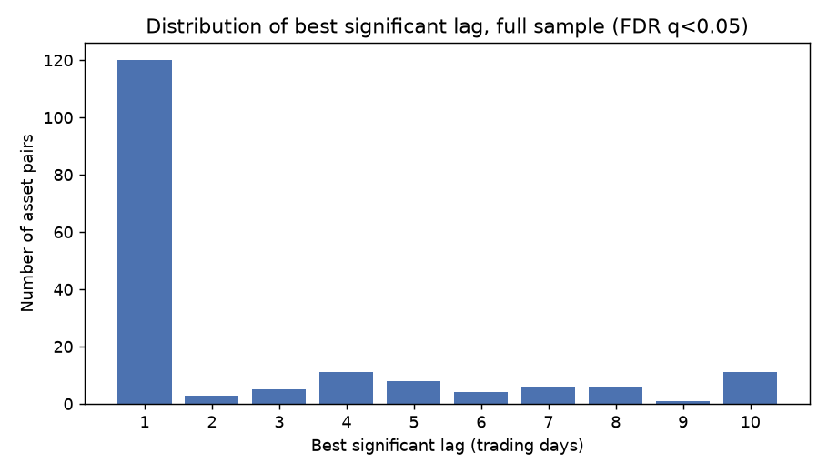
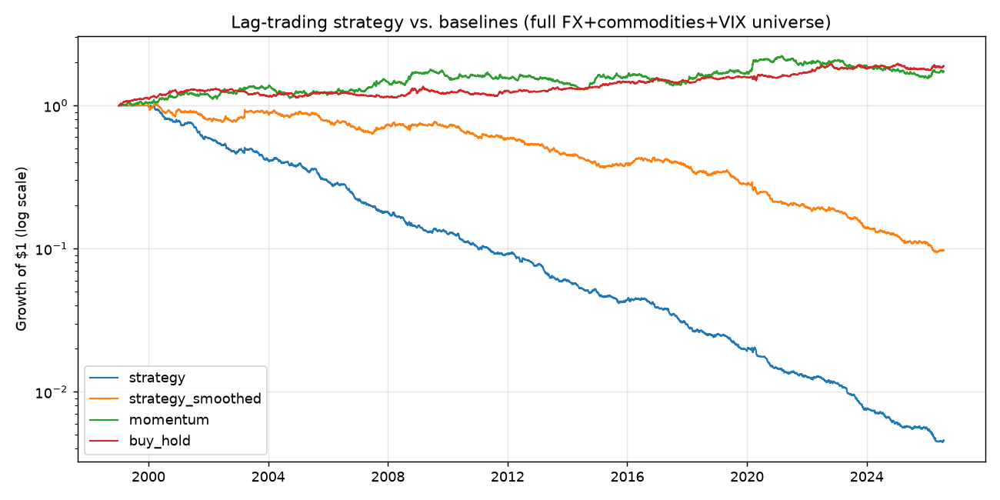
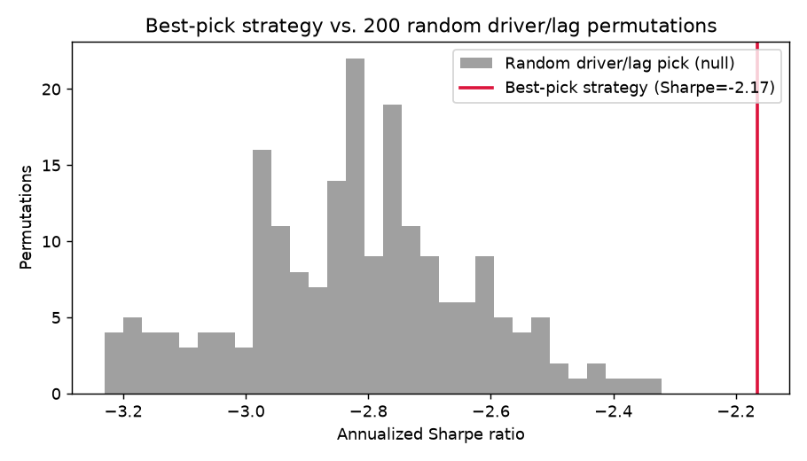

# Does trading the information-propagation lag work? — experimental results

**Question tested:** across a cross-asset graph, does one asset's move today
measurably predict another asset's move some days later, and can that delay
be traded profitably?

**Short answer:** the lag effect is real but tiny, decays within one trading
day, is partly a data artifact of managed currencies, and does not survive
realistic transaction costs. Simple momentum and buy-and-hold beat it
outright over 1999–2026.

## Data and universe (read this before the numbers)

This sandbox's network egress is locked down to a short host allowlist.
Yahoo Finance, FRED, Stooq, and Alpha Vantage all returned `403` at the
proxy. The only reachable price data was the `datasets` GitHub org
(`raw.githubusercontent.com`, itself ultimately sourced from FRED), which
gave us:

- **21 USD exchange rates** (Australia, Brazil, Canada, China, Denmark,
  Euro, Hong Kong, India, Japan, Malaysia, Mexico, New Zealand, Norway,
  Singapore, South Africa, South Korea, Sweden, Switzerland, Taiwan,
  Thailand, UK)
- **WTI and Brent crude** (daily)
- **VIX** (daily, driver-only — not directly tradable without futures-roll
  modeling we didn't build)

**No equities.** So this experiment tests the propagation-delay hypothesis
on an FX + commodities + volatility graph, not stocks. 24 nodes, daily bars,
1999-01-04 to 2026-07-29 (~7,190 trading days). One data cleaning step:
WTI printed -$36.98 on 2020-04-20 (the well-known negative-oil-futures
contract-roll event); that single day's ±300% "return" was clipped to ±30%
so it doesn't dominate every result touching oil.

## Method

1. **Full-sample lag discovery** — for every ordered pair and lag 1–10 days,
   Pearson-correlate `driver_t` against `target_{t+k}`. 552 pairs × 10 lags =
   5,520 tests, Benjamini-Hochberg FDR correction at q<0.05.
2. **Walk-forward backtest, no lookahead** — every 21 trading days, re-scan
   each tradable target's best driver+lag using only the trailing 252 days.
   Trade it off the driver's already-realized lagged return between
   rebalances. 3bps cost per unit turnover, portfolio vol-targeted to 8%
   annualized (max 3x leverage).
3. **Baselines** — time-series momentum (each asset traded off its own
   trailing 21-day return) and an equal-weight buy-and-hold basket, same
   universe.
4. **Permutation-null control** — 200 times, repeat the exact same backtest
   mechanics but replace "pick the best-correlated driver/lag" with "pick a
   uniformly random one from the same candidate pool." This isolates whether
   the selection process finds real structure or whether scanning ~230
   candidates per target just produces lucky in-sample correlations
   (classic multiple-testing bias).
5. **Robustness check** — rerun everything excluding Malaysia, China, and
   Hong Kong, whose exchange rates were pegged or capital-controlled for
   large stretches of the sample (a managed fixing schedule can look exactly
   like a "1-day lag" without any real information propagation behind it).

## 1. Does a lag effect exist at all?

| Universe | Pairs with ≥1 significant lag (FDR q<0.05) | Median best lag |
|---|---|---|
| Full (24 assets) | 31.7% | **1 trading day** |
| Ex managed-float FX | 27.4% | **1 trading day** |



Yes — about 3 in 10 ordered pairs show a statistically significant lagged
relationship, comfortably more than the ~5% FDR would allow by chance alone.
But the effect is dominated by **lag = 1**: whatever gets left on the table
is priced in within a single trading day. There's no meaningful multi-day
propagation window to trade in this universe at daily frequency.

The single strongest relationship in the whole scan is WTI → Brent at 1 day
(r=0.20, unsurprising — same commodity, two quote venues). After that, the
next dozen strongest pairs in the full universe all have `fx_Malaysia` as
the target, which is the tell for the caveat below.

## 2. Backtest: does it make money?

| Strategy | Sharpe | Ann. return | Max DD | Turnover/day |
|---|---:|---:|---:|---:|
| **Lag strategy (with costs)** | **-2.17** | -18.5% | -99.6% | 2.63x |
| Lag strategy (no costs) | 0.16 | +1.4% | -30.7% | — |
| Lag strategy (smoothed, EMA hl=3, w/ costs) | -0.91 | -7.8% | -90.7% | 1.23x |
| Time-series momentum | 0.27 | +2.3% | -30.4% | — |
| Buy-and-hold basket | 0.43 | +2.4% | -14.5% | — |



Before costs, the raw signal is roughly break-even (Sharpe ≈ 0), already a
sign there's little edge. What actually happens is that a signal built from
"yesterday's lagged return" refreshes every single day even though the
underlying driver/lag relationship only gets re-picked monthly — so the
strategy re-trades ~2.6x its book value daily. At 3bps that's real drag, and
it turns a near-zero raw edge sharply negative. Smoothing the signal (EMA,
3-day half-life) roughly halves turnover but the Sharpe is still clearly
negative — there just isn't enough edge to cover any reasonable cost
assumption. Both plain momentum and a static buy-and-hold basket beat it
without even trying.

## 3. Is the selection process finding real structure, or is this multiple-testing luck?



This is the important chart. The best-pick strategy (red line, Sharpe
-2.17) sits at the **100th percentile** of 200 random driver/lag
permutations run through identical mechanics (null mean -2.82, std 0.19).
In the ex-managed-FX universe it's at the **99.5th percentile**. That's a
real, statistically distinguishable effect — argmax-correlation selection
is not indistinguishable from picking a random pair.

So there is genuine, non-random structure being detected. It's just an
order of magnitude too small to survive trading it at daily frequency with
realistic costs. "Statistically real" and "economically tradable" are
different bars, and this clears the first one, not the second.

## 4. How much of "the lag" is just managed-currency fixing mechanics?

| Universe | Lag strategy Sharpe (no costs) |
|---|---:|
| Full (incl. MYR/CNY/HKD) | **+0.16** |
| Ex managed-float FX | **-0.03** |

Removing Malaysia, China, and Hong Kong — currencies that were pegged or
capital-controlled for meaningful parts of this sample — takes even the
pre-cost, best-case Sharpe to roughly zero. A chunk of what looked like
"information propagation delay" in the full universe was actually a
managed-fixing artifact (an official rate that updates a day behind free-
floating markets), not organic cross-market information flow. That's a
useful negative result on its own: naive lag-discovery on a currency
universe will pick up peg/intervention mechanics unless you explicitly
screen them out.

## Bottom line

- The core hypothesis — "markets take measurable time to fully price in
  related-asset information" — has real, statistically significant support
  in this data (permutation test, 99.5th–100th percentile).
- The measured propagation window is **short (~1 day)** and the resulting
  edge is **small relative to trading costs and turnover** for the naive
  implementation tested here (direct lagged-return signal, daily rebalance,
  3bps costs).
- Simple, boring baselines (own-asset momentum, static buy-and-hold) beat
  this approach outright over the full sample.
- Before investing more effort in the causal-graph direction, the highest-
  value next experiments are: (a) test on genuinely liquid, low-cost
  instruments (futures, not spot proxies) to see if the edge survives a more
  realistic cost model than the flat 3bps used here; (b) test intraday /
  higher-frequency data, since a 1-day propagation window is invisible if
  the true window is hours, not days; (c) explicitly exclude managed/pegged
  instruments from candidate pools rather than post-hoc; (d) size positions
  off the *strength* of the historical correlation (e.g., only trade pairs
  above a corr threshold with position sizing proportional to correlation
  quality) instead of trading every target uniformly, which is currently
  diluting the signal with low-confidence picks.

## Reproduce

```
cd experiments/lag_propagation
pip install -r ../../requirements.txt
python3 run.py
```
Outputs land in `results/`: `summary.json` (all metrics), and the PNGs
referenced above. Runtime ≈ 2 minutes (dominated by the 200-permutation
null test).
