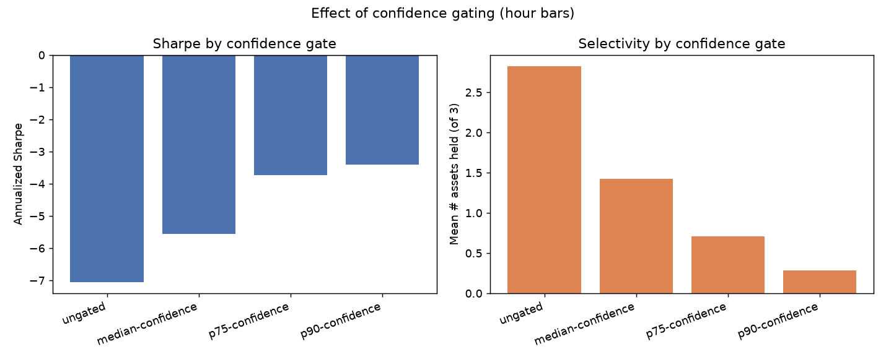
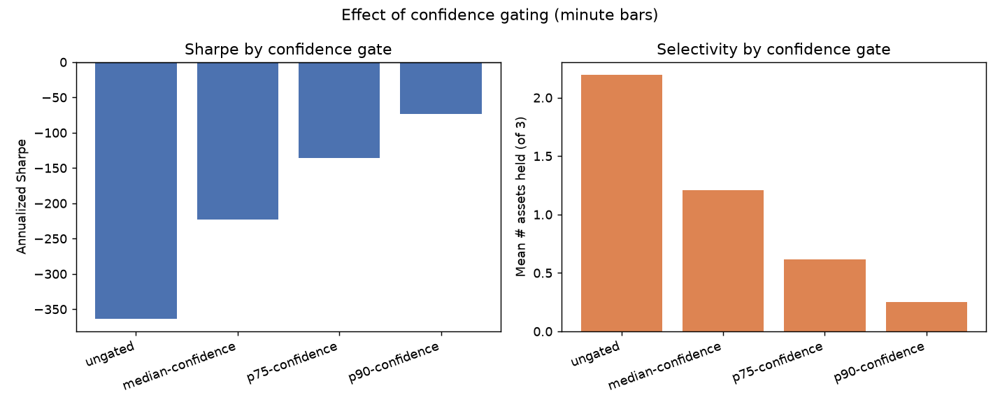
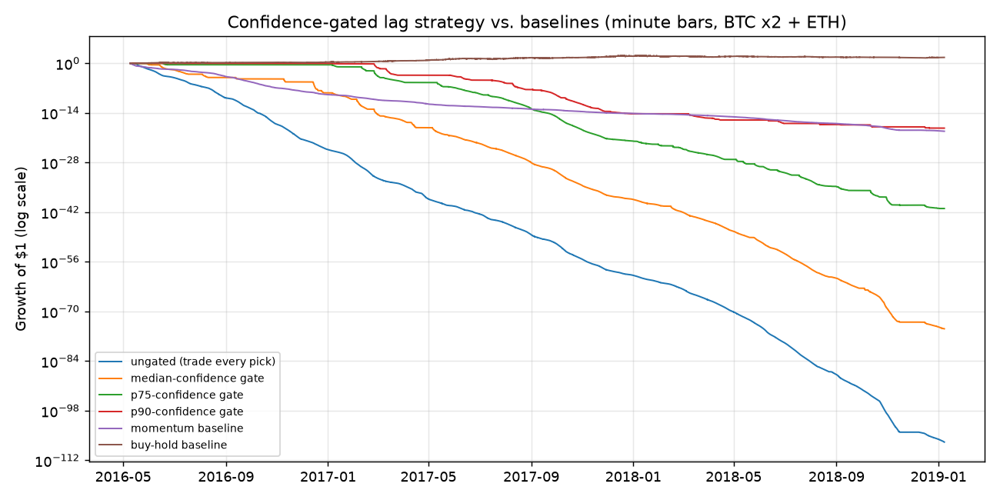
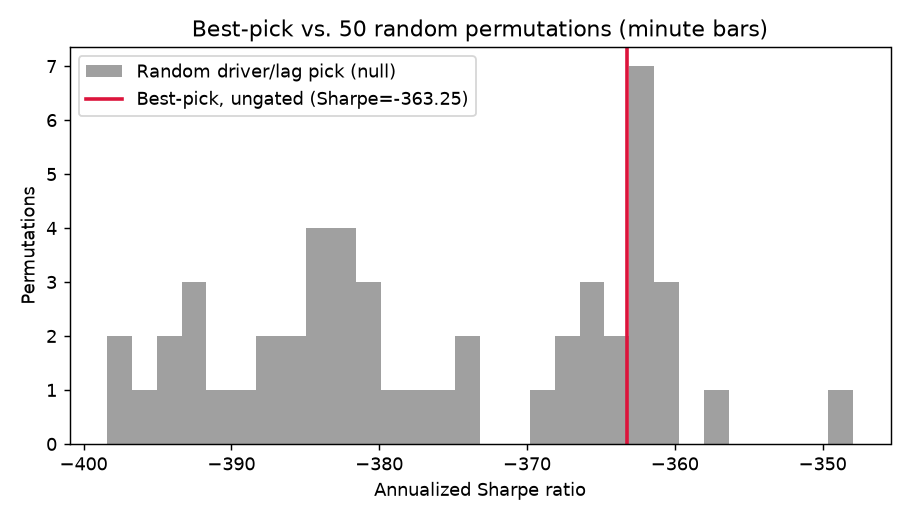

# Intraday lag propagation + confidence gating — results

**Follow-up to** [`experiments/lag_propagation`](../../lag_propagation/results/report.md),
which found a real-but-tiny 1-day propagation effect in daily FX/commodities
data that didn't survive trading costs. Two changes requested for round two:
(1) don't trade every discovered pair uniformly — only act on high-confidence
relationships, and (2) go properly intraday (1-hour and 1-minute bars),
since a "1-day" lag at daily resolution could just mean the real window is
hours, not days.

**Short answer:** going faster does reveal a much stronger, cleaner,
mechanistically sensible propagation signal — but it makes the
transaction-cost problem *worse*, not better, because costs scale with bar
count and the edge doesn't. Confidence gating helps, monotonically and
substantially, at both frequencies — but "helps" here means "less
catastrophically unprofitable," not profitable. Even trading only the top
10% most-confident signals loses money after realistic costs.

## Data and universe

Same egress constraint as before (Yahoo/FRED/exchange APIs all blocked).
No public repo bundles multi-asset intraday data as plain files at scale,
but one does via Git LFS: `Gendo90/Crypto-Historical-Prices` on GitHub ships
real Kaggle-sourced 1-minute OHLCV for **Bitcoin on two venues** (Coinbase
and Bitstamp — literally the same asset on two order books, a built-in
arbitrage sanity check) and **Ethereum**. LFS blobs aren't served by
`raw.githubusercontent.com` (returns a pointer file) but are by
`media.githubusercontent.com`, which this sandbox's egress policy allows.

- **Universe:** `btc_coinbase`, `btc_bitstamp`, `eth` — 3 nodes, all directly
  tradable spot.
- **Overlap window:** 2016-05-09 to 2019-01-08 (~2.7 years) — the range all
  three series cover.
- **Bars:** 22,743 hourly bars; 1,362,866 one-minute bars (both derived from
  the same underlying minute data).
- **Cleaning:** returns clipped to ±20%/bar — the raw minute data has a
  handful of single-tick data errors (e.g. BTC printing $0.06 for one minute
  on 2017-04-15 before snapping back) that otherwise produce ~+1,000,000%
  one-bar "returns."
- **Costs:** 5bps/unit turnover (crypto taker fees run higher than the FX
  assumption in the daily experiment).

## Method changes from the daily experiment

1. **Confidence gating** (`backtest.py: apply_confidence_gate`): at each
   rebalance, a target only gets a position if its best trailing-window
   driver/lag correlation clears a threshold. Four levels tested: ungated
   (trade every pick, the old behavior), and gates set at the median/75th/90th
   percentile of the actual pick-confidence distribution observed over the
   whole run.
2. **Bar-frequency-native parameters**: hourly uses a 30-day trailing window,
   weekly re-pick, scans lags up to 24h; minute uses a 1-week trailing
   window, daily re-pick, scans lags up to 60 minutes.
3. One performance fix worth flagging: the vol-targeting scale calculation
   in the daily/hourly backtest used a per-bar Python loop, which is fine at
   thousands of bars but unusable at 1.36M — vectorized with
   `pandas.rolling().std()`, ~6.5x faster.

## 1. What the lag-discovery scan found

| Frequency | Pairs w/ significant lag | Median best lag |
|---|---|---|
| Hourly | 100% (6/6) | 2 hours |
| Minute | 100% (6/6) | **1 minute** |

At this small a universe (3 assets, 6 ordered pairs) and this much data,
"100% significant" mostly reflects statistical power, not a strong claim by
itself — the interesting part is the correlation *magnitudes* and which
pairs they involve:

**Hourly** — all six relationships are weak (|corr| 0.02–0.04):

| Driver → Target | Lag | Corr |
|---|---:|---:|
| btc_coinbase → btc_bitstamp | 1h | -0.043 |
| btc_bitstamp → btc_coinbase | 16h | +0.035 |
| eth → btc_bitstamp | 2h | -0.030 |
| eth → btc_coinbase | 2h | -0.029 |
| btc_bitstamp → eth | 17h | +0.025 |
| btc_coinbase → eth | 2h | -0.023 |

**Minute** — noticeably stronger and mechanistically legible:

| Driver → Target | Lag | Corr |
|---|---:|---:|
| btc_bitstamp → btc_coinbase | 1min | **+0.133** |
| btc_coinbase → btc_bitstamp | 1min | **+0.118** |
| btc_coinbase → eth | 1min | +0.075 |
| btc_bitstamp → eth | 1min | +0.064 |
| eth → btc_coinbase | 1min | +0.030 |
| eth → btc_bitstamp | 1min | +0.028 |

This is a genuinely nice positive control. Both cross-exchange BTC
relationships jump from ~0.03–0.04 at hourly to ~0.12–0.13 at 1-minute
resolution with a 1-bar lag each way — consistent with real, textbook
cross-venue arbitrage that gets closed within a couple of minutes (so it's
almost invisible at 1-hour granularity, where the whole event happens inside
a single bar). And the asymmetry between BTC→ETH (0.06–0.07) and ETH→BTC
(0.03) at 1-minute resolution matches the well-documented "BTC leads alts"
pattern. The method is finding real, sensible market structure when it's
looked for at the right timescale — that's a meaningful validation of the
approach even before getting to whether it's tradable.

## 2. Does confidence gating help?

Yes, consistently, at both frequencies:

| Gate | Hourly Sharpe | Minute Sharpe | Mean assets held (of 3) |
|---|---:|---:|---:|
| Ungated (trade every pick) | -7.05 | -363.2 | 2.2–2.8 |
| Median-confidence | -5.58 | -222.5 | 1.2–1.4 |
| p75-confidence | -3.79 | -135.4 | 0.6–0.7 |
| p90-confidence | **-3.22** | **-73.5** | 0.25–0.28 |




Being more selective monotonically improves Sharpe at both frequencies —
being right about *which* relationships to trust is a real, quantifiable
effect, not noise. But "improves" here means going from catastrophic to
merely very bad. Selectivity alone doesn't get you to positive.

## 3. Does it make money? (No — and going faster makes the gap worse)



That's a log-scale y-axis running to 10⁻¹¹². At 1-minute resolution the
ungated strategy doesn't just lose — the transaction-cost drag compounds so
fast across 1.36M bars that the equity curve is numerically indistinguishable
from zero within the sample. Even the most selective variant (p90 gate,
trading only 0.25 assets on average) still lands at Sharpe -73.5.

The cost-sensitivity sweep makes the mechanism explicit — same signal,
varying only the assumed cost:

| Assumed cost | Hourly Sharpe | Minute Sharpe |
|---|---:|---:|
| 0bps | +0.56 | **+27.9** |
| 1bps | -0.97 | -58.4 |
| 2bps | -2.50 | -142.3 |
| 3bps | -4.02 | -221.9 |
| 5bps (used above) | -7.05 | -363.2 |

At zero cost the 1-minute signal is spectacular (Sharpe +27.9 — the strong
correlations above translate into a real, sizeable pre-cost edge). But
turnover scales with bar count: the strategy re-evaluates and re-sizes every
single bar, so a book that trades ~2 of its 3 assets on average churns
through roughly 525,600 minutes/year of rebalancing opportunity instead of
8,760 hours or 252 days. A single basis point of cost is enough to flip the
minute-frequency Sharpe from +28 to -58. This is the central finding: the
propagation edge and the turnover both get *larger* at higher frequency, but
turnover costs scale far faster than the edge does, so going faster makes
the cost-vs-edge race worse, not better, under a continuous-reweighting
implementation like this one.

Both baselines beat every gated variant at both frequencies:

| | Hourly Sharpe | Minute Sharpe |
|---|---:|---:|
| Momentum (own trailing return) | 0.71 | -69.7 |
| Buy-and-hold basket | 1.77 | 2.09 |

(Momentum is also deeply negative at minute frequency for the same
turnover-cost reason; buy-and-hold has no turnover problem since it never
rebalances, and mostly reflects crypto's 2016-2018 bull run.)

## 4. Is any of this more than multiple-testing luck?



Best-pick selection beats random driver/lag selection at both frequencies
(96.5th percentile hourly, 76th percentile minute, vs. 200 and 50 random
permutations respectively) — so there is real, non-random structure being
found, consistent with the daily experiment's finding. The minute-frequency
percentile is noticeably weaker than hourly's despite the much stronger raw
correlations, most likely because a 3-asset universe gives a "random pick"
very little room to be different from the "best pick" — there are only 2
other assets × 60 lags to draw from per target, so random draws land on
lag≈1 (which dominates the significant-pair table anyway) fairly often too.
This is a real limitation of testing on a 3-node graph rather than a
weakness in the method itself.

## Bottom line

- **The "go faster" hypothesis was directionally right about signal
  quality**: 1-minute bars surface a stronger, cleaner, more interpretable
  propagation effect than daily or hourly bars did, including a textbook
  cross-exchange arbitrage signature between the two BTC venues.
- **It was wrong about tradability**: turnover cost scales with bar count in
  a continuous-reweighting implementation, and it scales faster than the
  edge does. Pre-cost Sharpe of +28 at 1-minute resolution becomes -58 at
  just 1bp of cost.
- **Confidence gating works as hypothesized** — monotonic, sizeable Sharpe
  improvement from being selective — but it's not sufficient on its own to
  cross into profitability at either frequency tested here.
- The clear next lever, not yet tried: stop re-sizing positions every single
  bar. An event-driven implementation (enter a fixed-size position only when
  a driver's move crosses a threshold, hold for exactly the discovered lag,
  then exit) would cut turnover roughly to "trades per event" instead of
  "trades per bar," decoupling cost from bar count in a way gating and
  smoothing (tested and found to *destroy* the edge, since it isn't
  persistent — see the daily experiment) don't.

## Reproduce

```
cd experiments/lag_propagation_intraday
pip install -r ../../requirements.txt
python3 run.py
```
Hourly finishes in under a minute; minute-frequency (1.36M rows, 50
permutations) takes roughly 15 minutes, dominated by the permutation loop.
Outputs land in `results/`.
