# Mechanism-Shift Testbed — report

Generated 2026-09-21 06:57 UTC. Bootstrap resamples: 2000; alpha = 0.05 (Holm across the 9 testable primaries: P1, P2, P3, P4, P7, P8, P5, P6, P9).

## Runs read

| label | kind | B | shift type | γ_h | hidden | seeds | agents | git | constants sha256 | wall s |
|---|---|---|---|---|---|---|---|---|---|---|
| `main` | main | 50 | large | 0 | no | 20 | 13 | 2983f0cbba | 6782fd19538d | 124 |
| `sweep_B10` | sweep | 10 | large | 0 | no | 20 | 4 | 7da9254057 | 5e87655a4eb0 | 39 |
| `sweep_B25` | sweep | 25 | large | 0 | no | 20 | 4 | d0eaabc075 | 5e1ea0aa1e88 | 41 |
| `sweep_B100` | sweep | 100 | large | 0 | no | 20 | 3 | 99ab19807a | c26b660d5d41 | 41 |
| `hidden` | hidden | 50 | large | 0 | yes | 40 | 8 | b72a99374d | 6782fd19538d | 162 |
| `knob_large_h1` | knob | 50 | large | 1 | no | 20 | 4 | 5852adafc4 | 6782fd19538d | 48 |
| `knob_noise-only_h0` | knob | 50 | noise-only | 0 | no | 20 | 4 | 132c2f9aee | 6782fd19538d | 48 |
| `knob_noise-only_h1` | knob | 50 | noise-only | 1 | no | 20 | 4 | 132c2f9aee | 6782fd19538d | 48 |
| `knob_small_h0` | knob | 50 | small | 0 | no | 20 | 4 | 132c2f9aee | 6782fd19538d | 48 |
| `knob_small_h1` | knob | 50 | small | 1 | no | 20 | 4 | 132c2f9aee | 6782fd19538d | 48 |

## Pre-registered predictions — verdicts (Holm-adjusted, alpha = 0.05)

| P | claim | run | seeds | primary scalar: mean [95 % CI] | p (one-sided) | Holm p | verdict |
|---|---|---|---|---|---|---|---|
| **P1** | see is not do: obs-window's nMSE sits at the population floor F_obs (inside +/-(0.1 F_obs + 0.01)) in >= 80 % of seeds | `main` | 20 | -0.015 [-0.020, -0.011] (fraction inside band 1.00) | 0.0005 | 0.0045 | **HELD** |
| **P2** | recovery: regret(mech-full) - 2 regret(mech-oracle-detect) <= 0 (both vs oracle-structure) | `main` | 20 | -0.178 [-0.266, -0.114] | 0.0005 | 0.0045 | **HELD** |
| **P3** | calibration: mech-full 90 % coverage in stable, SHD = 0 episodes within +/-5 points of nominal | `main` | 16 | 0.005 [-0.058, 0.049] | 0.0420 | 0.1679 | **NOT HELD** |
| **P4** | memory: forgetting bump(mech-reset-all) - bump(mech-full) >= 0.04 | `main` | 20 | 0.002 [-0.001, 0.005] | 1.0000 | 1.0000 | **NOT HELD** |
| **P7** | credit assignment: mech-full delay-0 attribution accuracy has CI lower bound >= 0.8 | `main` | 20 | 1.000 [1.000, 1.000] | 0.0005 | 0.0045 | **HELD** |
| **P8** | objectives: self_score(mech-full) - self_score(mech-overconfident) > 0 (episodes 10-60) | `main` | 20 | 0.012 [-0.009, 0.031] | 0.1249 | 0.3748 | **NOT HELD** |
| **P5** | structure: nMSE(int-pairwise) - nMSE(mech-full) > 0 at B = 10, episodes 20-60 | `sweep_B10` | 20 | 0.134 [0.109, 0.162] | 0.0005 | 0.0045 | **HELD** |
| **P6** | hidden confounder: mech-full 90 % coverage on do(A) -> B (episodes 40-60) has CI upper bound < 0.5 | `hidden` | 40 | 0.111 [0.089, 0.138] | 0.0005 | 0.0045 | **HELD** |
| **P9** | noise-only shifts: mech-full's regret vs oracle-structure >= 0.02 per shift | `knob_noise-only_h0` | 20 | 0.023 [0.012, 0.035] | 0.3098 | 0.6197 | **NOT HELD** |

A prediction is HELD iff its Holm-adjusted one-sided bootstrap test rejects in the predicted direction (SPEC 'Analysis plan'). CIs are unadjusted percentile-bootstrap intervals over per-seed scalars; differences between agents are paired by seed.

### P1 — see is not do: obs-window's nMSE sits at the population floor F_obs (inside +/-(0.1 F_obs + 0.01)) in >= 80 % of seeds

| primary scalar | run | seeds | mean [95 % CI] | test | p | Holm p | verdict |
|---|---|---|---|---|---|---|---|
| obs-window nMSE gap to F_obs inside the 10 % + 0.01 band in >= 80 % of seeds | `main` | 20 | -0.015 [-0.020, -0.011] | fraction of seeds inside the band > 0.800 | 0.0005 | 0.0045 | **HELD** |

Exploratory (P1 secondaries):

| quantity | mean [95 % CI] over seeds |
|---|---|
| mech-full nMSE below obs-window at episode 5 (fraction of seeds; predicted >= 0.9) | 1.00 [1.00, 1.00] |
| `obs-window` nMSE on non-descendant pairs (false effects; obs-* predicted bounded away from 0) | 0.173 [0.134, 0.234] |
| `obs-window` nMSE on descendant pairs | 0.068 [0.046, 0.093] |
| `obs-cumulative` nMSE on non-descendant pairs (false effects; obs-* predicted bounded away from 0) | 0.193 [0.146, 0.252] |
| `obs-cumulative` nMSE on descendant pairs | 0.469 [0.399, 0.539] |
| `int-pairwise` nMSE on non-descendant pairs (false effects; obs-* predicted bounded away from 0) | 0.076 [0.071, 0.082] |
| `int-pairwise` nMSE on descendant pairs | 0.092 [0.081, 0.105] |
| `mech-full` nMSE on non-descendant pairs (false effects; obs-* predicted bounded away from 0) | 0.001 [0.001, 0.002] |
| `mech-full` nMSE on descendant pairs | 0.082 [0.066, 0.101] |
| `marginal-mean` nMSE on non-descendant pairs (false effects; obs-* predicted bounded away from 0) | 0.113 [0.078, 0.152] |
| `marginal-mean` nMSE on descendant pairs | 0.639 [0.539, 0.754] |

### P2 — recovery: regret(mech-full) - 2 regret(mech-oracle-detect) <= 0 (both vs oracle-structure)

| primary scalar | run | seeds | mean [95 % CI] | test | p | Holm p | verdict |
|---|---|---|---|---|---|---|---|
| regret(mech-full) - 2 regret(mech-oracle-detect) <= 0 | `main` | 20 | -0.178 [-0.266, -0.114] | mean < 0.000 | 0.0005 | 0.0045 | **HELD** |

Exploratory (P2 secondaries; regret is vs `oracle-structure` over the shift episode and the three following; recovery = Kaplan–Meier on `m >= 0.05` shifts with a seed-level cluster bootstrap; 'within k' counts the shift episode as the first):

| agent | regret per shift | KM median recovery (episodes) | recovered within 1 | within 2 (mech-full predicted >= 0.9) | within 3 | censored fraction (obs-cumulative predicted >= 0.5) | events |
|---|---|---|---|---|---|---|---|
| `mech-full` | 0.131 [0.096, 0.170] | 0.0 [0.0, 0.0] | 0.78 [0.70, 0.84] | 0.85 [0.78, 0.91] | 0.88 [0.82, 0.94] | 0.03 | 121 |
| `mech-oracle-detect` | 0.154 [0.105, 0.218] | 0.0 [0.0, 0.0] | 0.74 [0.67, 0.80] | 0.79 [0.71, 0.85] | 0.87 [0.79, 0.93] | 0.06 | 121 |
| `mech-random` | 0.135 [0.099, 0.177] | 0.0 [0.0, 0.0] | 0.86 [0.79, 0.92] | 0.93 [0.86, 0.98] | 0.93 [0.87, 0.98] | 0.03 | 121 |
| `mech-reset-all` | 0.132 [0.096, 0.170] | 0.0 [0.0, 0.0] | 0.84 [0.76, 0.92] | 0.88 [0.81, 0.95] | 0.89 [0.83, 0.95] | 0.06 | 121 |
| `mech-no-detect` | 0.255 [0.192, 0.323] | 1.0 [1.0, 1.0] | 0.21 [0.15, 0.27] | 0.62 [0.51, 0.73] | 0.75 [0.67, 0.83] | 0.12 | 121 |
| `obs-window` | 0.565 [0.441, 0.743] | 0.0 [0.0, 0.0] | 0.79 [0.75, 0.84] | 0.85 [0.80, 0.90] | 0.89 [0.85, 0.94] | 0.09 | 121 |
| `obs-cumulative` | 1.434 [1.165, 1.702] | 2.0 [0.0, 3.0] | 0.46 [0.40, 0.52] | 0.50 [0.44, 0.56] | 0.52 [0.46, 0.58] | 0.38 | 121 |
| `int-pairwise` | 0.464 [0.393, 0.549] | 2.0 [1.0, 2.0] | 0.11 [0.04, 0.18] | 0.39 [0.28, 0.50] | 0.89 [0.83, 0.95] | 0.02 | 121 |
| `oracle-structure` | 0.000 [0.000, 0.000] | 0.0 [0.0, 0.0] | 1.00 [1.00, 1.00] | 1.00 [1.00, 1.00] | 1.00 [1.00, 1.00] | 0.00 | 121 |

### P3 — calibration: mech-full 90 % coverage in stable, SHD = 0 episodes within +/-5 points of nominal

| primary scalar | run | seeds | mean [95 % CI] | test | p | Holm p | verdict |
|---|---|---|---|---|---|---|---|
| mech-full 90 % coverage (stable, SHD = 0) within +/-5 points of nominal | `main` | 16 | 0.005 [-0.058, 0.049] | mean inside [-0.050, 0.050] | 0.0420 | 0.1679 | **NOT HELD** |

Per-seed values that could not be computed: seed 5: no stable episode with SHD = 0; seed 7: no stable episode with SHD = 0; seed 8: no stable episode with SHD = 0; seed 13: no stable episode with SHD = 0

Exploratory (Metric 4; each cell is 90 % coverage / mean normalized width90, on ALL predictions of the stratum; SHD and path strata exist for learned-structure agents only):

| agent | stable | shift | post-shift | SHD = 0 | SHD > 0 | paths equal | paths differ | abstain rate |
|---|---|---|---|---|---|---|---|---|
| `marginal-mean` | 0.421 / 0.06 | 0.378 / 0.05 | 0.391 / 0.05 | — / — | — / — | — / — | — / — | 0.000 |
| `obs-window` | 0.518 / 0.27 | 0.518 / 0.27 | 0.512 / 0.27 | — / — | — / — | — / — | — / — | 0.101 |
| `obs-cumulative` | 0.260 / 0.07 | 0.217 / 0.06 | 0.218 / 0.06 | — / — | — / — | — / — | — / — | 0.094 |
| `int-pairwise` | 0.871 / 0.75 | 0.760 / 0.78 | 0.829 / 0.78 | — / — | — / — | — / — | — / — | 0.080 |
| `mech-full` | 0.819 / 0.07 | 0.833 / 0.09 | 0.837 / 0.07 | 0.909 / 0.07 | 0.801 / 0.08 | 0.893 / 0.07 | 0.282 / 0.12 | 0.095 |
| `mech-random` | 0.813 / 0.07 | 0.827 / 0.09 | 0.838 / 0.07 | 0.901 / 0.07 | 0.789 / 0.08 | 0.886 / 0.07 | 0.254 / 0.12 | 0.086 |
| `mech-full-nofloor` | 0.732 / 0.07 | 0.739 / 0.10 | 0.740 / 0.08 | 0.871 / 0.09 | 0.730 / 0.08 | 0.890 / 0.07 | 0.266 / 0.10 | 0.109 |
| `mech-reset-all` | 0.799 / 0.12 | 0.827 / 0.22 | 0.808 / 0.17 | 0.904 / 0.13 | 0.778 / 0.14 | 0.865 / 0.13 | 0.324 / 0.15 | 0.123 |
| `mech-no-detect` | 0.835 / 0.16 | 0.685 / 0.16 | 0.721 / 0.16 | 0.897 / 0.16 | 0.779 / 0.16 | 0.869 / 0.16 | 0.286 / 0.18 | 0.080 |
| `mech-oracle-detect` | 0.804 / 0.07 | 0.809 / 0.08 | 0.816 / 0.07 | 0.922 / 0.07 | 0.779 / 0.07 | 0.884 / 0.06 | 0.229 / 0.10 | 0.100 |
| `mech-overconfident` | 0.824 / 0.08 | 0.831 / 0.09 | 0.839 / 0.08 | 0.893 / 0.08 | 0.806 / 0.08 | 0.897 / 0.08 | 0.284 / 0.12 | 0.094 |
| `oracle-structure` | 0.919 / 0.06 | 0.920 / 0.08 | 0.930 / 0.06 | 0.921 / 0.07 | — / — | 0.921 / 0.07 | — / — | 0.096 |
| `oracle` | 1.000 / 0.00 | 1.000 / 0.00 | 1.000 / 0.00 | — / — | — / — | — / — | — / — | 0.000 |

P3(b) (exploratory): shift episodes with `m >= 0.05` where the detector did NOT reset the shifted mechanism at step 4 — mech-full on j-dependent queries:

| quantity | value |
|---|---|
| undetected / qualifying shifts (pooled) | 0 / 121 |
| 90 % coverage on j-dependent queries in the shift episode (predicted < 0.5) | — |
| abstention excess over the stable rate, points (predicted <= 0.02) | — |

P3(c) (exploratory): `int-pairwise` stable-episode 90 % coverage = 0.871 [0.866, 0.876] (predicted within ±0.05 of 0.9). 
At B = 10, nMSE(int-pairwise)/nMSE(mech-full) at the last episode = 1.68 [1.17, 2.27] (predicted >= 3).

### P4 — memory: forgetting bump(mech-reset-all) - bump(mech-full) >= 0.04

| primary scalar | run | seeds | mean [95 % CI] | test | p | Holm p | verdict |
|---|---|---|---|---|---|---|---|
| forgetting bump: mech-reset-all - mech-full >= 0.04 | `main` | 20 | 0.002 [-0.001, 0.005] | mean > 0.040 | 1.0000 | 1.0000 | **NOT HELD** |

Exploratory (Metric 3; forgetting bump = nMSE on j-independent queries in the shift episode minus its mean over the two previous episodes; predicted: mech-reset-all >= 0.05, mech-full < 0.01, windowed baselines show a bump, mech-no-detect none):

| agent | forgetting bump per shift | regret per shift |
|---|---|---|
| `mech-reset-all` | 0.000 [-0.002, 0.003] | 0.132 [0.096, 0.170] |
| `mech-full` | -0.002 [-0.005, 0.002] | 0.131 [0.096, 0.170] |
| `obs-window` | 0.011 [0.004, 0.018] | 0.565 [0.441, 0.743] |
| `int-pairwise` | 0.036 [0.015, 0.060] | 0.464 [0.393, 0.549] |
| `mech-no-detect` | 0.015 [0.004, 0.027] | 0.255 [0.192, 0.323] |
| `mech-random` | -0.000 [-0.006, 0.007] | 0.135 [0.099, 0.177] |
| `mech-oracle-detect` | 0.007 [-0.002, 0.021] | 0.154 [0.105, 0.218] |
| `oracle-structure` | 0.000 [0.000, 0.000] | 0.000 [0.000, 0.000] |

### P5 — structure: nMSE(int-pairwise) - nMSE(mech-full) > 0 at B = 10, episodes 20-60

| primary scalar | run | seeds | mean [95 % CI] | test | p | Holm p | verdict |
|---|---|---|---|---|---|---|---|
| nMSE(int-pairwise) - nMSE(mech-full) > 0 at B = 10, episodes 20-60 | `sweep_B10` | 20 | 0.134 [0.109, 0.162] | mean > 0.000 | 0.0005 | 0.0045 | **HELD** |

Exploratory (P5 secondaries; paired per-seed differences; nMSE over episodes 20-60, SHD over 10-60):

| budget | (a) int-pairwise − mech-full nMSE (> 0 at 10; within ±0.02 at 100) | (b) mech-full − mech-random nMSE (< 0 at 10, 25; closes at 100) | (c) SHD mech-full − mech-random (predicted <= 0) | (c) SHD nofloor − mech-random (> 0 at 10) |
|---|---|---|---|---|
| B = 10 (`sweep_B10`) | 0.134 [0.109, 0.162] | 0.004 [-0.004, 0.013] | 0.30 [-0.07, 0.66] | 1.16 [0.56, 1.72] |
| B = 25 (`sweep_B25`) | 0.084 [0.073, 0.096] | -0.004 [-0.013, 0.002] | 0.13 [-0.01, 0.27] | 3.32 [2.77, 3.88] |
| B = 50 (`main`) | 0.053 [0.046, 0.061] | -0.002 [-0.006, 0.001] | 0.14 [-0.01, 0.29] | 3.83 [3.25, 4.40] |
| B = 100 (`sweep_B100`) | 0.033 [0.027, 0.040] | -0.001 [-0.004, 0.001] | 0.05 [-0.05, 0.17] | — |

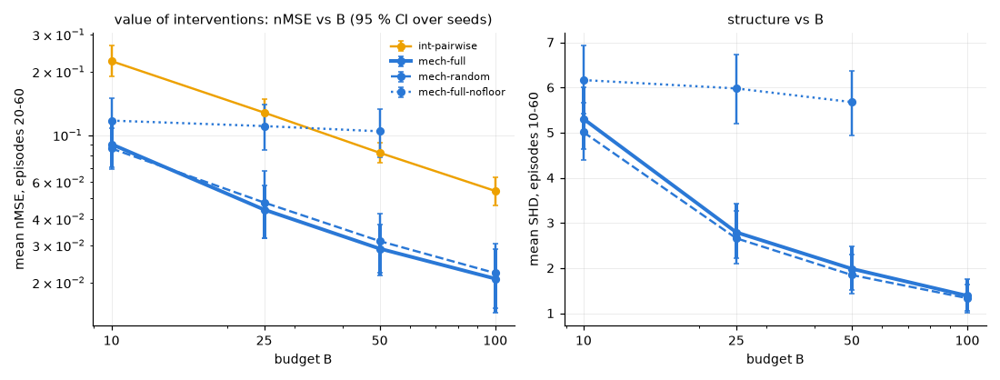

### P6 — hidden confounder: mech-full 90 % coverage on do(A) -> B (episodes 40-60) has CI upper bound < 0.5

| primary scalar | run | seeds | mean [95 % CI] | test | p | Holm p | verdict |
|---|---|---|---|---|---|---|---|
| mech-full 90 % coverage on do(A) -> B, episodes 40-60, CI upper < 0.5 | `hidden` | 40 | 0.111 [0.089, 0.138] | mean < 0.500 | 0.0005 | 0.0045 | **HELD** |

Exploratory (P6 secondaries):

| claim | value |
|---|---|
| (i) mech-full SHD = 0 at episode 10 (fraction of seeds; predicted >= 0.8) | 0.12 [0.03, 0.23] |
| (ii) slope error on do(A) → B divided by c, mech-full, episodes 40-60, |v| >= 1 | 0.67 [-0.10, 1.45] |
| (ii) fraction of seeds with the ratio in [0.3, 1.0] (predicted >= 0.8) | 0.23 |
| (iii) mech-full abstention on (A, B) minus its global rate, points (predicted <= 0.02) | 0.041 [-0.011, 0.097] |
| (iv) H shift resets both A and B in the same episode (fraction of seeds; predicted >= 0.5) | 0.68 [0.53, 0.80] |
| (iv) H shift resets at least one visible mechanism (fraction of seeds) | 0.78 [0.65, 0.90] |
| population confounding bias c (mean over seeds) | 0.053 [-0.105, 0.199] |
| implied nMSE floor F_conf on do(A) → B | 0.081 [0.036, 0.141] |

90 % coverage on do(A) → B queries, episodes 40-60, per agent (diagnostic `mech-full-diag` predicted within ±0.10 of 0.9; `obs-*` and `oracle-structure` predicted biased):

| agent | coverage on (A, B) | overall nMSE | SHD 10-60 |
|---|---|---|---|
| `obs-cumulative` | 0.023 [0.017, 0.030] | 0.250 [0.214, 0.289] | — |
| `int-pairwise` | 0.864 [0.846, 0.883] | 0.076 [0.073, 0.080] | — |
| `mech-full` | 0.111 [0.089, 0.138] | 0.037 [0.030, 0.046] | 2.61 [2.28, 2.95] |
| `mech-random` | 0.112 [0.087, 0.141] | 0.038 [0.030, 0.048] | 2.37 [2.08, 2.68] |
| `mech-oracle-detect` | 0.091 [0.068, 0.118] | 0.067 [0.052, 0.085] | 2.60 [2.24, 2.98] |
| `oracle-structure` | 0.131 [0.093, 0.178] | 0.008 [0.004, 0.013] | 0.00 [0.00, 0.00] |
| `oracle` | 1.000 [1.000, 1.000] | 0.000 [0.000, 0.000] | — |
| `mech-full-diag` | 0.630 [0.561, 0.700] | 0.056 [0.048, 0.066] | 2.57 [2.24, 2.91] |

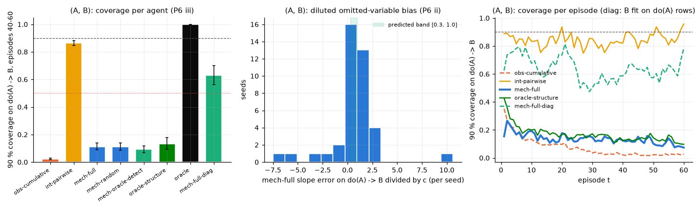

### P7 — credit assignment: mech-full delay-0 attribution accuracy has CI lower bound >= 0.8

| primary scalar | run | seeds | mean [95 % CI] | test | p | Holm p | verdict |
|---|---|---|---|---|---|---|---|
| mech-full delay-0 attribution accuracy, CI lower >= 0.8 | `main` | 20 | 1.000 [1.000, 1.000] | mean > 0.800 | 0.0005 | 0.0045 | **HELD** |

Exploratory (Metric 8 across configurations; predicted: main false-reset rate <= 0.02; under γ_h = 1 mech-full's accuracy drops >= 15 points and misattribution rises while mech-oracle-detect's nMSE moves < 0.02):

| run | agent | shifts | excluded (m < 0.05) | resets | accuracy (delay 0) | recall in {t, t+1} | misattribution rate | attribution precision | false-reset rate / mech-episode | correct / wrong / miss / false alarms | nMSE |
|---|---|---|---|---|---|---|---|---|---|---|---|
| `main` | `mech-full` | 121 | 39 | 306 | 1.00 [1.00, 1.00] | 1.00 [1.00, 1.00] | 0.44 [0.33, 0.56] | 0.44 [0.39, 0.49] | 0.0126 [0.0089, 0.0178] | 121 / 0 / 0 / 65 | 0.030 [0.023, 0.038] |
| `main` | `mech-oracle-detect` | 121 | 39 | 160 | 1.00 [1.00, 1.00] | 1.00 [1.00, 1.00] | 0.00 [0.00, 0.00] | 0.76 [0.69, 0.81] | 0.0000 [0.0000, 0.0000] | 121 / 0 / 0 / 0 | 0.037 [0.025, 0.054] |
| `knob_large_h1` | `mech-full` | 121 | 39 | 926 | 0.95 [0.91, 0.98] | 0.99 [0.98, 1.00] | 0.73 [0.62, 0.83] | 0.17 [0.13, 0.21] | 0.1000 [0.0793, 0.1202] | 120 / 1 / 0 / 516 | 0.091 [0.074, 0.109] |
| `knob_large_h1` | `mech-oracle-detect` | 121 | 39 | 160 | 1.00 [1.00, 1.00] | 1.00 [1.00, 1.00] | 0.00 [0.00, 0.00] | 0.76 [0.69, 0.81] | 0.0000 [0.0000, 0.0000] | 121 / 0 / 0 / 0 | 0.111 [0.084, 0.143] |
| `knob_small_h0` | `mech-full` | 1 | 159 | 163 | 1.00 [1.00, 1.00] | 1.00 [1.00, 1.00] | 0.00 [0.00, 0.00] | 0.01 [0.00, 0.02] | 0.0078 [0.0056, 0.0101] | 1 / 0 / 0 / 40 | 0.009 [0.006, 0.013] |
| `knob_small_h0` | `mech-oracle-detect` | 1 | 159 | 160 | 1.00 [1.00, 1.00] | 1.00 [1.00, 1.00] | 0.00 [0.00, 0.00] | 0.01 [0.00, 0.02] | 0.0000 [0.0000, 0.0000] | 1 / 0 / 0 / 0 | 0.009 [0.006, 0.012] |
| `knob_noise-only_h0` | `mech-full` | 138 | 22 | 165 | 0.66 [0.58, 0.76] | 0.74 [0.65, 0.82] | 0.10 [0.04, 0.16] | 0.65 [0.57, 0.74] | 0.0087 [0.0062, 0.0114] | 102 / 1 / 35 / 45 | 0.009 [0.006, 0.012] |
| `knob_noise-only_h0` | `mech-oracle-detect` | 138 | 22 | 160 | 1.00 [1.00, 1.00] | 1.00 [1.00, 1.00] | 0.00 [0.00, 0.00] | 0.86 [0.82, 0.90] | 0.0000 [0.0000, 0.0000] | 138 / 0 / 0 / 0 | 0.009 [0.006, 0.012] |
| `knob_noise-only_h1` | `mech-full` | 138 | 22 | 954 | 0.73 [0.67, 0.78] | 0.80 [0.74, 0.86] | 0.64 [0.56, 0.72] | 0.16 [0.12, 0.20] | 0.1172 [0.0899, 0.1465] | 111 / 17 / 10 / 605 | 0.061 [0.051, 0.072] |
| `knob_noise-only_h1` | `mech-oracle-detect` | 138 | 22 | 160 | 1.00 [1.00, 1.00] | 1.00 [1.00, 1.00] | 0.00 [0.00, 0.00] | 0.86 [0.82, 0.90] | 0.0000 [0.0000, 0.0000] | 138 / 0 / 0 / 0 | 0.054 [0.044, 0.064] |
| `knob_small_h1` | `mech-full` | 1 | 159 | 934 | 1.00 [1.00, 1.00] | 1.00 [1.00, 1.00] | 1.00 [1.00, 1.00] | 0.00 [0.00, 0.00] | 0.1236 [0.0959, 0.1531] | 1 / 0 / 0 / 638 | 0.066 [0.053, 0.082] |
| `knob_small_h1` | `mech-oracle-detect` | 1 | 159 | 160 | 1.00 [1.00, 1.00] | 1.00 [1.00, 1.00] | 0.00 [0.00, 0.00] | 0.01 [0.00, 0.02] | 0.0000 [0.0000, 0.0000] | 1 / 0 / 0 / 0 | 0.058 [0.047, 0.072] |

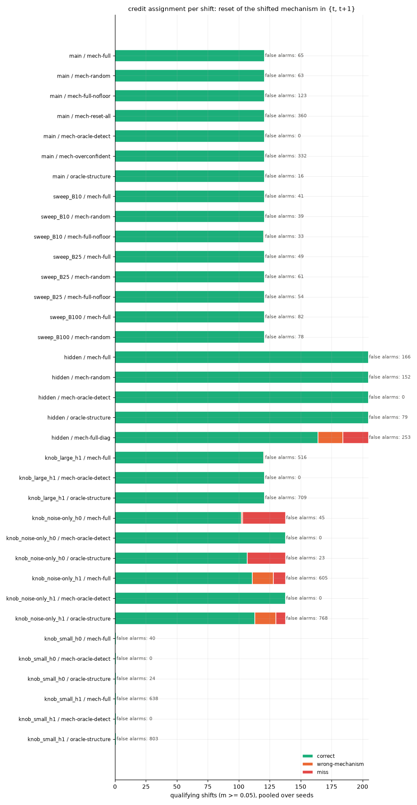

### P8 — objectives: self_score(mech-full) - self_score(mech-overconfident) > 0 (episodes 10-60)

| primary scalar | run | seeds | mean [95 % CI] | test | p | Holm p | verdict |
|---|---|---|---|---|---|---|---|
| self_score(mech-full) - self_score(mech-overconfident) > 0 | `main` | 20 | 0.012 [-0.009, 0.031] | mean > 0.000 | 0.1249 | 0.3748 | **NOT HELD** |

Exploratory (P8 secondaries; predicted: mech-overconfident has the larger var_obj decrease in episodes 1-10, abstains < 2 %, and has 90 % coverage >= 20 points worse and AURC worse than mech-full):

| agent | self log-score (10-60) | var_obj decrease (1-10) | abstain rate | cov90 stable | AURC | AURC oracle order | AURC random order | nMSE |
|---|---|---|---|---|---|---|---|---|
| `mech-full` | -7.56 [-7.86, -7.26] | 0.003 [0.001, 0.004] | 0.095 [0.074, 0.116] | 0.819 | 0.007 [0.005, 0.009] | 0.001 [0.000, 0.001] | 0.030 [0.023, 0.038] | 0.030 [0.023, 0.038] |
| `mech-overconfident` | -7.57 [-7.88, -7.27] | 0.004 [0.002, 0.006] | 0.094 [0.070, 0.121] | 0.824 | 0.009 [0.006, 0.013] | 0.001 [0.001, 0.001] | 0.030 [0.023, 0.038] | 0.030 [0.023, 0.038] |
| `mech-random` | -7.42 [-7.71, -7.13] | 0.002 [0.001, 0.004] | 0.086 [0.066, 0.106] | 0.813 | 0.007 [0.005, 0.008] | 0.001 [0.000, 0.001] | 0.032 [0.024, 0.041] | 0.032 [0.024, 0.041] |
| `oracle-structure` | -6.98 [-7.20, -6.74] | 0.009 [0.007, 0.012] | 0.096 [0.079, 0.114] | 0.919 | 0.000 [0.000, 0.000] | 0.000 [0.000, 0.000] | 0.001 [0.000, 0.001] | 0.001 [0.000, 0.001] |

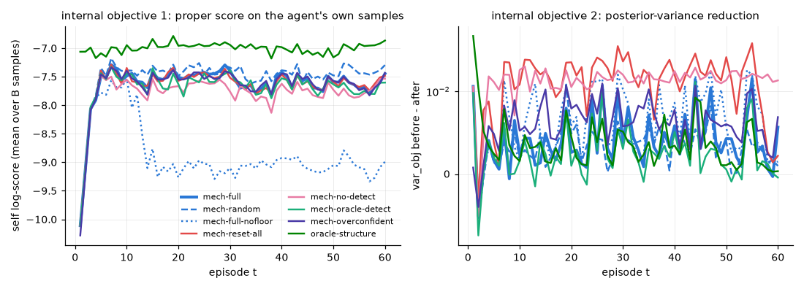

### P9 — noise-only shifts: mech-full's regret vs oracle-structure >= 0.02 per shift

| primary scalar | run | seeds | mean [95 % CI] | test | p | Holm p | verdict |
|---|---|---|---|---|---|---|---|
| mech-full regret vs oracle-structure on noise-only shifts >= 0.02 | `knob_noise-only_h0` | 20 | 0.023 [0.012, 0.035] | mean > 0.020 | 0.3098 | 0.6197 | **NOT HELD** |

Exploratory (noise-only; regret vs oracle-structure; `mech-oracle-detect` is predicted to pay the same price):

| agent | regret per noise-only shift (δσ >= 0.05) | nMSE | false-reset rate |
|---|---|---|---|
| `mech-full` | 0.023 [0.012, 0.035] | 0.009 [0.006, 0.012] | 0.0087 [0.0062, 0.0114] |
| `mech-oracle-detect` | 0.023 [0.013, 0.034] | 0.009 [0.006, 0.012] | 0.0000 [0.0000, 0.0000] |
| `int-pairwise` | 0.227 [0.214, 0.239] | 0.057 [0.054, 0.059] | — |
| `oracle-structure` | 0.000 [0.000, 0.000] | 0.001 [0.000, 0.001] | 0.0045 [0.0025, 0.0066] |

Exploratory (`small` shifts):

| quantity | value |
|---|---|
| detection recall on m >= 0.05 shifts, reset in {t, t+1} (predicted < 0.6) | 1.00 [1.00, 1.00] |
| detection recall, any later episode before the next shift | 1.00 [1.00, 1.00] |
| undetected / qualifying shifts | 0 / 1 |
| undetected shifts: max 90 % coverage on j-dependent queries over {t, t+1} (predicted < 0.7) | — |
| undetected shifts: abstention excess over the stable rate (predicted no rise) | — |

## Exploratory tables per run

### `main` — nMSE (Metric 1) and selective risk (Metric 5)

| agent | nMSE | stable | shift | post-shift | descendant | non-descendant | non-abstained | abstain rate | AURC | mistake recall | mistake precision | SHD 10-60 | wall s |
|---|---|---|---|---|---|---|---|---|---|---|---|---|---|
| `marginal-mean` | 0.291 [0.235, 0.358] | 0.278 [0.225, 0.342] | 0.334 [0.269, 0.411] | 0.320 [0.257, 0.394] | 0.639 [0.539, 0.754] | 0.113 [0.078, 0.152] | 0.291 [0.235, 0.358] | 0.000 [0.000, 0.000] | 0.245 [0.200, 0.300] | 0.000 [0.000, 0.000] | — | — | 1.540 [1.512, 1.570] |
| `obs-window` | 0.137 [0.107, 0.180] | 0.136 [0.106, 0.181] | 0.141 [0.112, 0.182] | 0.139 [0.111, 0.178] | 0.068 [0.046, 0.093] | 0.173 [0.134, 0.234] | 0.135 [0.107, 0.174] | 0.101 [0.085, 0.118] | 0.110 [0.090, 0.136] | 0.094 [0.073, 0.116] | 0.146 [0.096, 0.208] | — | 0.629 [0.614, 0.645] |
| `obs-cumulative` | 0.287 [0.235, 0.345] | 0.264 [0.215, 0.321] | 0.362 [0.300, 0.425] | 0.340 [0.281, 0.401] | 0.469 [0.399, 0.539] | 0.193 [0.146, 0.252] | 0.259 [0.209, 0.314] | 0.094 [0.078, 0.111] | 0.188 [0.151, 0.229] | 0.134 [0.100, 0.169] | 0.303 [0.253, 0.360] | — | 2.182 [2.145, 2.219] |
| `int-pairwise` | 0.082 [0.076, 0.090] | 0.058 [0.056, 0.060] | 0.200 [0.157, 0.251] | 0.096 [0.085, 0.108] | 0.092 [0.081, 0.105] | 0.076 [0.071, 0.082] | 0.070 [0.066, 0.074] | 0.080 [0.059, 0.103] | 0.046 [0.044, 0.048] | 0.189 [0.150, 0.229] | 0.172 [0.144, 0.204] | — | 2.180 [2.149, 2.217] |
| `mech-full` | 0.030 [0.023, 0.038] | 0.030 [0.023, 0.039] | 0.029 [0.022, 0.036] | 0.027 [0.020, 0.035] | 0.082 [0.066, 0.101] | 0.001 [0.001, 0.002] | 0.020 [0.016, 0.024] | 0.095 [0.074, 0.116] | 0.007 [0.005, 0.009] | 0.361 [0.289, 0.438] | 0.105 [0.087, 0.125] | 1.984 [1.517, 2.487] | 2.221 [2.199, 2.243] |
| `mech-random` | 0.032 [0.024, 0.041] | 0.033 [0.025, 0.042] | 0.031 [0.021, 0.043] | 0.027 [0.019, 0.037] | 0.089 [0.070, 0.111] | 0.001 [0.001, 0.001] | 0.022 [0.017, 0.026] | 0.086 [0.066, 0.106] | 0.007 [0.005, 0.008] | 0.336 [0.278, 0.395] | 0.114 [0.095, 0.137] | 1.847 [1.425, 2.291] | 1.996 [1.982, 2.010] |
| `mech-full-nofloor` | 0.087 [0.068, 0.109] | 0.085 [0.067, 0.106] | 0.092 [0.070, 0.117] | 0.094 [0.074, 0.116] | 0.252 [0.206, 0.303] | 0.001 [0.001, 0.002] | 0.075 [0.058, 0.095] | 0.109 [0.083, 0.136] | 0.047 [0.036, 0.061] | 0.234 [0.172, 0.303] | 0.160 [0.135, 0.185] | 5.676 [4.944, 6.357] | 2.181 [2.161, 2.203] |
| `mech-reset-all` | 0.031 [0.023, 0.039] | 0.031 [0.023, 0.039] | 0.032 [0.023, 0.042] | 0.032 [0.023, 0.042] | 0.083 [0.065, 0.103] | 0.002 [0.002, 0.003] | 0.022 [0.018, 0.027] | 0.123 [0.098, 0.147] | 0.017 [0.014, 0.021] | 0.337 [0.274, 0.401] | 0.073 [0.058, 0.089] | 1.977 [1.498, 2.504] | 2.209 [2.197, 2.221] |
| `mech-no-detect` | 0.043 [0.033, 0.055] | 0.032 [0.024, 0.040] | 0.103 [0.075, 0.134] | 0.047 [0.035, 0.058] | 0.107 [0.085, 0.130] | 0.009 [0.006, 0.012] | 0.033 [0.026, 0.040] | 0.080 [0.056, 0.107] | 0.016 [0.014, 0.019] | 0.245 [0.168, 0.326] | 0.129 [0.097, 0.160] | 2.022 [1.563, 2.527] | 2.184 [2.164, 2.209] |
| `mech-oracle-detect` | 0.037 [0.025, 0.054] | 0.037 [0.024, 0.052] | 0.043 [0.027, 0.066] | 0.035 [0.023, 0.050] | 0.096 [0.071, 0.128] | 0.005 [0.001, 0.010] | 0.026 [0.018, 0.037] | 0.100 [0.082, 0.117] | 0.010 [0.007, 0.014] | 0.337 [0.272, 0.411] | 0.100 [0.079, 0.124] | 1.968 [1.507, 2.458] | 2.179 [2.160, 2.199] |
| `mech-overconfident` | 0.030 [0.023, 0.038] | 0.031 [0.024, 0.039] | 0.030 [0.022, 0.041] | 0.028 [0.019, 0.036] | 0.083 [0.067, 0.102] | 0.001 [0.001, 0.002] | 0.021 [0.017, 0.026] | 0.094 [0.070, 0.121] | 0.009 [0.006, 0.013] | 0.326 [0.263, 0.396] | 0.101 [0.082, 0.121] | 1.987 [1.515, 2.504] | 2.236 [2.217, 2.258] |
| `oracle-structure` | 0.001 [0.000, 0.001] | 0.001 [0.000, 0.001] | 0.001 [0.001, 0.001] | 0.001 [0.000, 0.001] | 0.001 [0.001, 0.001] | 0.000 [0.000, 0.001] | 0.000 [0.000, 0.000] | 0.096 [0.079, 0.114] | 0.000 [0.000, 0.000] | — | 0.000 [0.000, 0.000] | 0.000 [0.000, 0.000] | 2.105 [2.087, 2.123] |
| `oracle` | 0.000 [0.000, 0.000] | 0.000 [0.000, 0.000] | 0.000 [0.000, 0.000] | 0.000 [0.000, 0.000] | 0.000 [0.000, 0.000] | 0.000 [0.000, 0.000] | 0.000 [0.000, 0.000] | 0.000 [0.000, 0.000] | 0.000 [0.000, 0.000] | — | — | — | 0.110 [0.108, 0.113] |

`marginal-mean` floor: nMSE 0.291 [0.235, 0.358]. 
Qualifying shifts pooled over seeds: 121; excluded by the m >= 0.05 filter: 39.

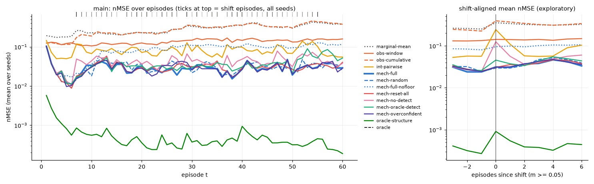

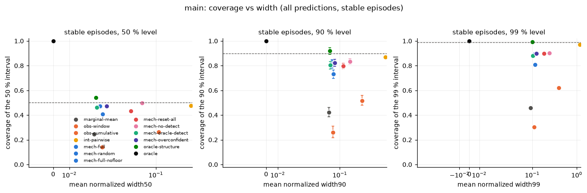

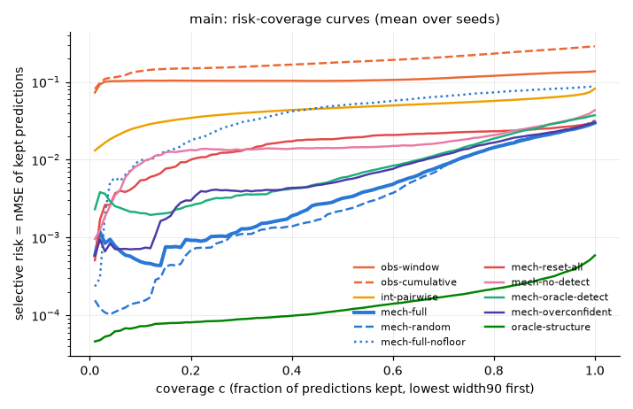

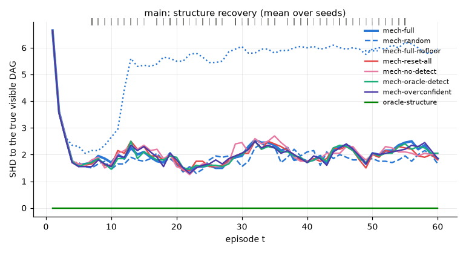

### `sweep_B10` — nMSE (Metric 1) and selective risk (Metric 5)

| agent | nMSE | stable | shift | post-shift | descendant | non-descendant | non-abstained | abstain rate | AURC | mistake recall | mistake precision | SHD 10-60 | wall s |
|---|---|---|---|---|---|---|---|---|---|---|---|---|---|
| `int-pairwise` | 0.216 [0.188, 0.250] | 0.171 [0.155, 0.189] | 0.372 [0.297, 0.459] | 0.308 [0.251, 0.376] | 0.288 [0.240, 0.338] | 0.177 [0.157, 0.201] | 0.181 [0.164, 0.201] | 0.072 [0.053, 0.093] | 0.133 [0.123, 0.144] | 0.138 [0.106, 0.171] | 0.383 [0.344, 0.425] | — | 2.098 [2.066, 2.134] |
| `mech-full` | 0.093 [0.075, 0.115] | 0.092 [0.074, 0.113] | 0.094 [0.075, 0.118] | 0.097 [0.076, 0.123] | 0.270 [0.224, 0.322] | 0.001 [0.001, 0.002] | 0.076 [0.062, 0.094] | 0.098 [0.078, 0.121] | 0.037 [0.030, 0.044] | 0.244 [0.191, 0.300] | 0.204 [0.174, 0.237] | 5.303 [4.634, 6.006] | 1.991 [1.953, 2.027] |
| `mech-random` | 0.092 [0.075, 0.112] | 0.090 [0.074, 0.110] | 0.100 [0.082, 0.122] | 0.096 [0.079, 0.117] | 0.271 [0.229, 0.318] | 0.001 [0.001, 0.001] | 0.073 [0.061, 0.089] | 0.098 [0.077, 0.121] | 0.032 [0.026, 0.038] | 0.261 [0.207, 0.318] | 0.217 [0.192, 0.241] | 5.008 [4.387, 5.669] | 1.687 [1.667, 1.707] |
| `mech-full-nofloor` | 0.116 [0.090, 0.147] | 0.116 [0.090, 0.146] | 0.120 [0.092, 0.152] | 0.115 [0.087, 0.148] | 0.339 [0.274, 0.413] | 0.001 [0.001, 0.001] | 0.101 [0.077, 0.130] | 0.098 [0.075, 0.122] | 0.058 [0.042, 0.077] | 0.212 [0.160, 0.271] | 0.209 [0.175, 0.246] | 6.164 [5.417, 6.925] | 1.752 [1.730, 1.775] |

Qualifying shifts pooled over seeds: 121; excluded by the m >= 0.05 filter: 39.

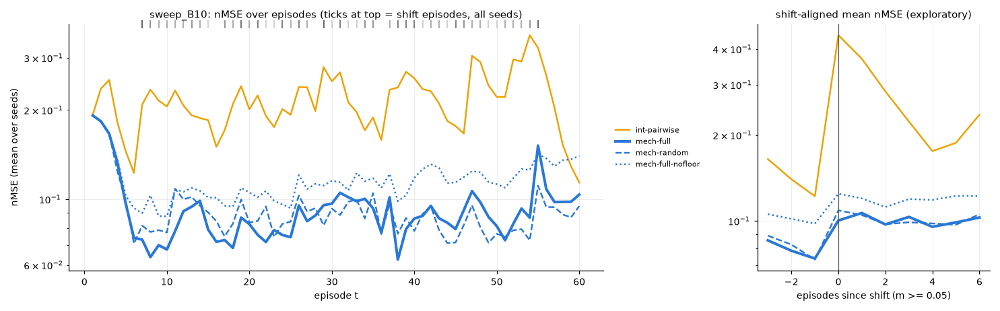

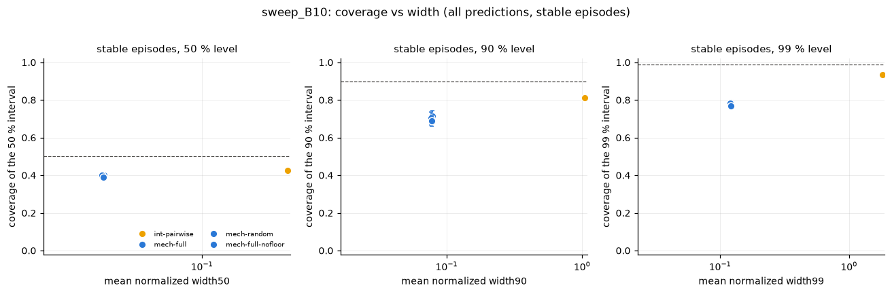

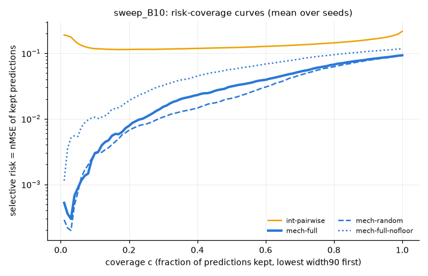

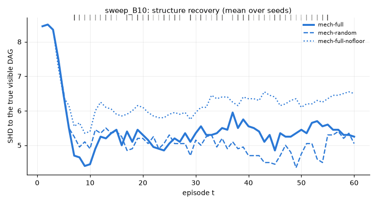

### `sweep_B25` — nMSE (Metric 1) and selective risk (Metric 5)

| agent | nMSE | stable | shift | post-shift | descendant | non-descendant | non-abstained | abstain rate | AURC | mistake recall | mistake precision | SHD 10-60 | wall s |
|---|---|---|---|---|---|---|---|---|---|---|---|---|---|
| `int-pairwise` | 0.129 [0.114, 0.146] | 0.089 [0.085, 0.093] | 0.282 [0.221, 0.352] | 0.192 [0.156, 0.233] | 0.163 [0.136, 0.192] | 0.110 [0.099, 0.123] | 0.107 [0.099, 0.115] | 0.076 [0.056, 0.099] | 0.071 [0.067, 0.074] | 0.166 [0.128, 0.210] | 0.260 [0.227, 0.294] | — | 2.061 [2.041, 2.080] |
| `mech-full` | 0.047 [0.036, 0.059] | 0.049 [0.037, 0.062] | 0.043 [0.033, 0.054] | 0.041 [0.031, 0.052] | 0.131 [0.104, 0.159] | 0.002 [0.001, 0.004] | 0.033 [0.026, 0.040] | 0.095 [0.074, 0.117] | 0.012 [0.009, 0.015] | 0.324 [0.268, 0.383] | 0.145 [0.124, 0.169] | 2.792 [2.222, 3.418] | 2.146 [2.116, 2.180] |
| `mech-random` | 0.050 [0.036, 0.070] | 0.050 [0.036, 0.067] | 0.051 [0.033, 0.078] | 0.050 [0.034, 0.073] | 0.141 [0.106, 0.187] | 0.001 [0.001, 0.001] | 0.032 [0.025, 0.040] | 0.097 [0.076, 0.119] | 0.012 [0.009, 0.014] | 0.348 [0.289, 0.411] | 0.156 [0.131, 0.188] | 2.660 [2.094, 3.270] | 1.834 [1.814, 1.854] |
| `mech-full-nofloor` | 0.102 [0.081, 0.126] | 0.100 [0.079, 0.125] | 0.109 [0.087, 0.135] | 0.104 [0.083, 0.126] | 0.295 [0.245, 0.352] | 0.001 [0.001, 0.001] | 0.088 [0.069, 0.111] | 0.102 [0.078, 0.127] | 0.054 [0.041, 0.070] | 0.219 [0.166, 0.277] | 0.191 [0.162, 0.221] | 5.978 [5.199, 6.720] | 1.884 [1.869, 1.904] |

Qualifying shifts pooled over seeds: 121; excluded by the m >= 0.05 filter: 39.

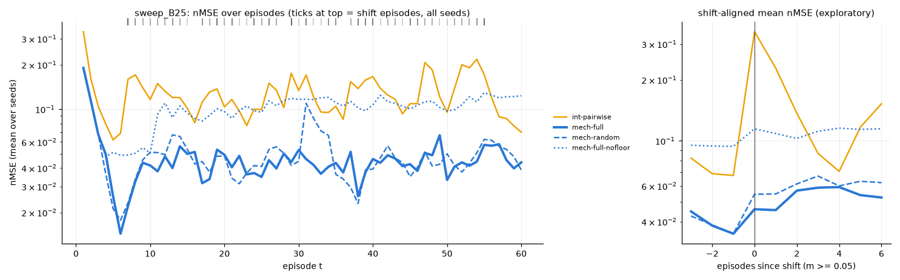

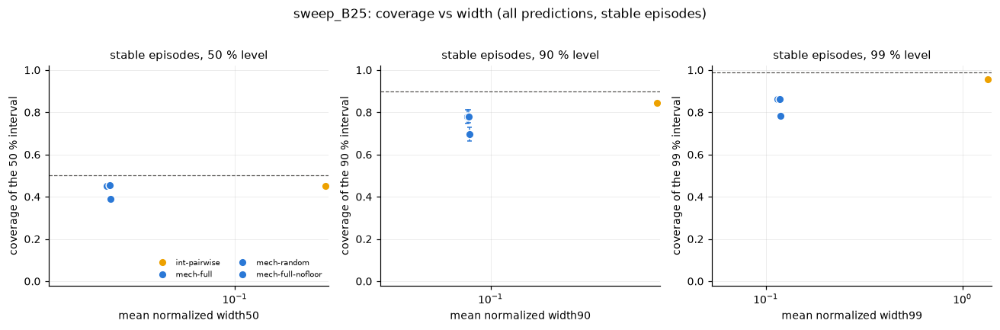

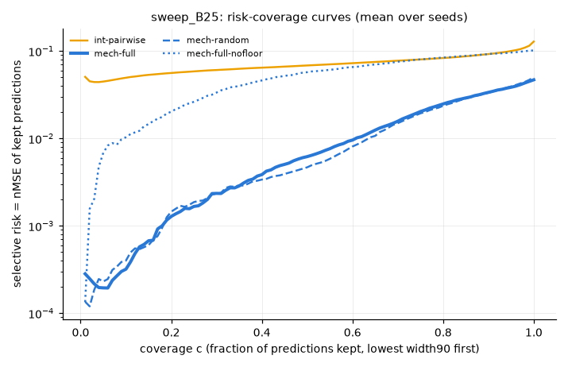

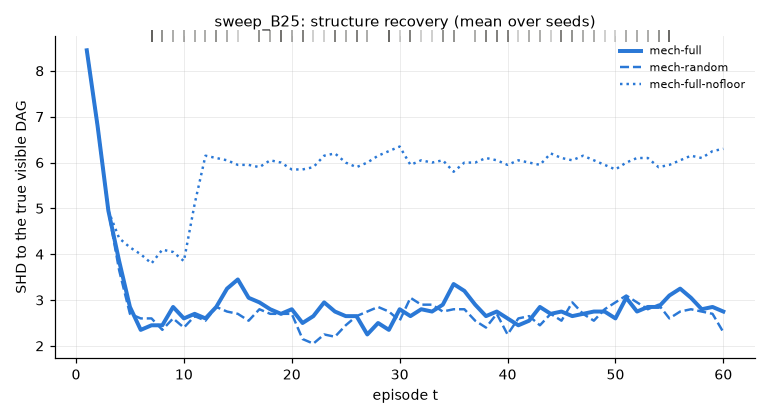

### `sweep_B100` — nMSE (Metric 1) and selective risk (Metric 5)

| agent | nMSE | stable | shift | post-shift | descendant | non-descendant | non-abstained | abstain rate | AURC | mistake recall | mistake precision | SHD 10-60 | wall s |
|---|---|---|---|---|---|---|---|---|---|---|---|---|---|
| `int-pairwise` | 0.053 [0.046, 0.061] | 0.029 [0.028, 0.030] | 0.175 [0.132, 0.224] | 0.065 [0.054, 0.077] | 0.070 [0.058, 0.083] | 0.044 [0.040, 0.049] | 0.042 [0.038, 0.046] | 0.076 [0.054, 0.100] | 0.025 [0.023, 0.026] | 0.281 [0.226, 0.338] | 0.137 [0.103, 0.180] | — | 2.321 [2.293, 2.352] |
| `mech-full` | 0.019 [0.014, 0.026] | 0.020 [0.014, 0.027] | 0.019 [0.014, 0.025] | 0.018 [0.012, 0.024] | 0.053 [0.039, 0.068] | 0.001 [0.001, 0.002] | 0.012 [0.009, 0.015] | 0.085 [0.064, 0.106] | 0.004 [0.003, 0.006] | 0.371 [0.288, 0.462] | 0.075 [0.058, 0.094] | 1.386 [1.044, 1.752] | 2.934 [2.907, 2.962] |
| `mech-random` | 0.021 [0.015, 0.029] | 0.023 [0.016, 0.030] | 0.020 [0.012, 0.030] | 0.017 [0.011, 0.023] | 0.060 [0.044, 0.077] | 0.001 [0.001, 0.001] | 0.014 [0.011, 0.018] | 0.084 [0.064, 0.104] | 0.004 [0.003, 0.005] | 0.335 [0.273, 0.399] | 0.076 [0.061, 0.095] | 1.333 [1.019, 1.642] | 2.624 [2.591, 2.662] |

Qualifying shifts pooled over seeds: 121; excluded by the m >= 0.05 filter: 39.

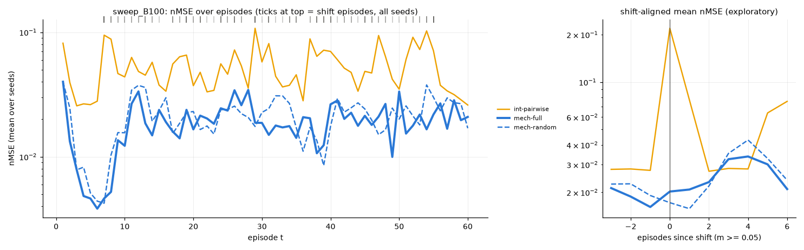

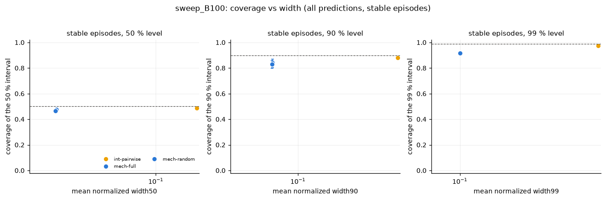

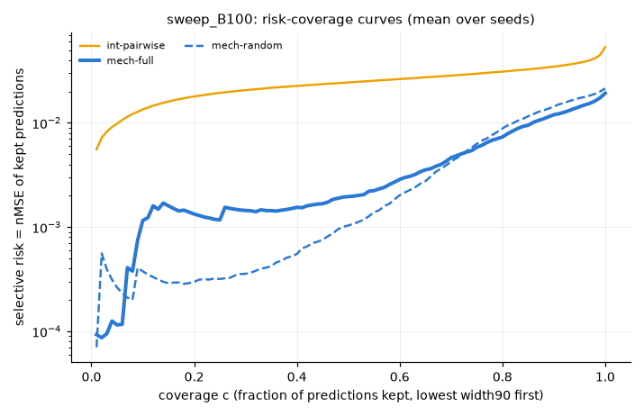

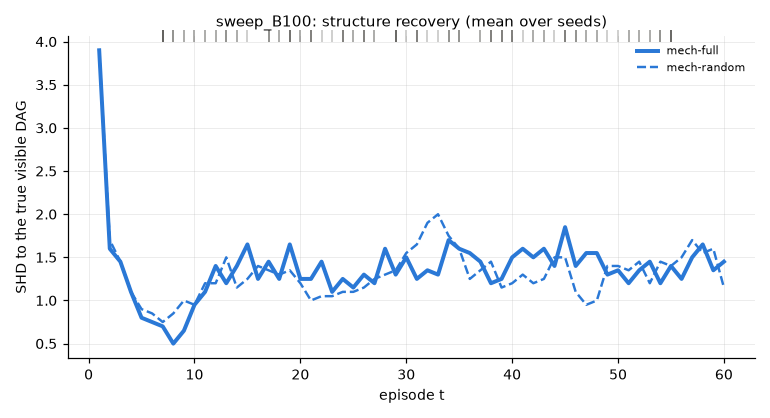

### `hidden` — nMSE (Metric 1) and selective risk (Metric 5)

| agent | nMSE | stable | shift | post-shift | descendant | non-descendant | non-abstained | abstain rate | AURC | mistake recall | mistake precision | SHD 10-60 | wall s |
|---|---|---|---|---|---|---|---|---|---|---|---|---|---|
| `obs-cumulative` | 0.250 [0.214, 0.289] | 0.234 [0.200, 0.271] | 0.302 [0.259, 0.349] | 0.285 [0.245, 0.329] | 0.361 [0.314, 0.408] | 0.189 [0.153, 0.230] | 0.229 [0.195, 0.267] | 0.116 [0.104, 0.130] | 0.188 [0.159, 0.222] | 0.163 [0.138, 0.189] | 0.281 [0.251, 0.315] | — | 2.179 [2.152, 2.208] |
| `int-pairwise` | 0.076 [0.073, 0.080] | 0.059 [0.057, 0.061] | 0.163 [0.145, 0.183] | 0.084 [0.079, 0.090] | 0.079 [0.073, 0.086] | 0.075 [0.072, 0.078] | 0.065 [0.063, 0.068] | 0.139 [0.119, 0.160] | 0.046 [0.044, 0.047] | 0.263 [0.233, 0.294] | 0.128 [0.115, 0.143] | — | 2.202 [2.175, 2.230] |
| `mech-full` | 0.037 [0.030, 0.046] | 0.038 [0.030, 0.047] | 0.036 [0.028, 0.045] | 0.037 [0.029, 0.045] | 0.101 [0.080, 0.126] | 0.001 [0.001, 0.002] | 0.025 [0.019, 0.031] | 0.142 [0.127, 0.159] | 0.011 [0.009, 0.014] | 0.454 [0.406, 0.504] | 0.104 [0.090, 0.119] | 2.615 [2.281, 2.952] | 2.423 [2.402, 2.446] |
| `mech-random` | 0.038 [0.030, 0.048] | 0.040 [0.032, 0.049] | 0.033 [0.026, 0.042] | 0.035 [0.026, 0.046] | 0.103 [0.081, 0.129] | 0.001 [0.001, 0.002] | 0.026 [0.020, 0.033] | 0.131 [0.115, 0.147] | 0.011 [0.008, 0.014] | 0.419 [0.370, 0.471] | 0.107 [0.091, 0.126] | 2.374 [2.076, 2.675] | 2.154 [2.136, 2.172] |
| `mech-oracle-detect` | 0.067 [0.052, 0.085] | 0.064 [0.050, 0.081] | 0.077 [0.060, 0.099] | 0.074 [0.056, 0.095] | 0.129 [0.105, 0.158] | 0.032 [0.018, 0.050] | 0.057 [0.042, 0.073] | 0.128 [0.113, 0.145] | 0.043 [0.030, 0.057] | 0.328 [0.274, 0.387] | 0.119 [0.103, 0.137] | 2.596 [2.235, 2.976] | 2.177 [2.167, 2.188] |
| `oracle-structure` | 0.008 [0.004, 0.013] | 0.008 [0.004, 0.013] | 0.008 [0.005, 0.013] | 0.008 [0.004, 0.013] | 0.024 [0.010, 0.043] | 0.001 [0.001, 0.001] | 0.006 [0.003, 0.010] | 0.153 [0.135, 0.171] | 0.003 [0.002, 0.005] | 0.502 [0.403, 0.600] | 0.017 [0.007, 0.029] | 0.000 [0.000, 0.000] | 2.145 [2.131, 2.159] |
| `oracle` | 0.000 [0.000, 0.000] | 0.000 [0.000, 0.000] | 0.000 [0.000, 0.000] | 0.000 [0.000, 0.000] | 0.000 [0.000, 0.000] | 0.000 [0.000, 0.000] | 0.000 [0.000, 0.000] | 0.000 [0.000, 0.000] | 0.000 [0.000, 0.000] | — | — | — | 0.110 [0.108, 0.114] |
| `mech-full-diag` | 0.056 [0.048, 0.066] | 0.053 [0.045, 0.063] | 0.071 [0.059, 0.085] | 0.060 [0.048, 0.073] | 0.131 [0.111, 0.151] | 0.013 [0.009, 0.017] | 0.020 [0.014, 0.029] | 0.319 [0.288, 0.351] | 0.016 [0.011, 0.025] | 0.787 [0.742, 0.832] | 0.130 [0.111, 0.151] | 2.573 [2.239, 2.912] | 2.254 [2.240, 2.269] |

Qualifying shifts pooled over seeds: 224; excluded by the m >= 0.05 filter: 96.

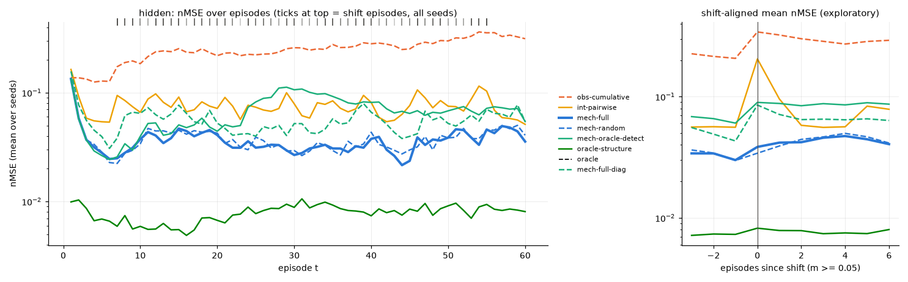

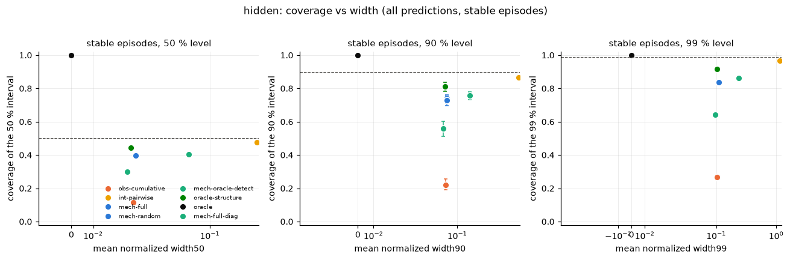

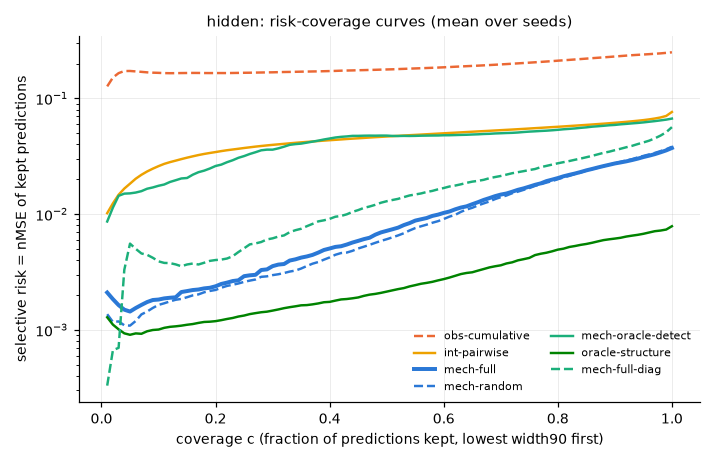

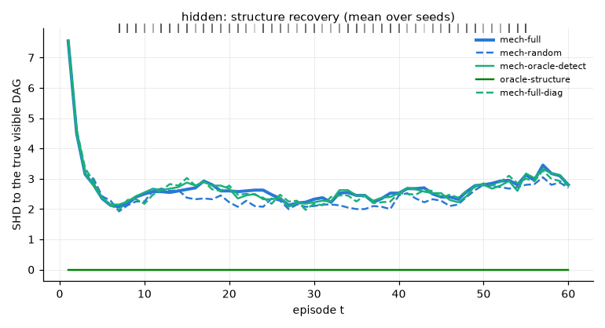

### `knob_large_h1` — nMSE (Metric 1) and selective risk (Metric 5)

| agent | nMSE | stable | shift | post-shift | descendant | non-descendant | non-abstained | abstain rate | AURC | mistake recall | mistake precision | SHD 10-60 | wall s |
|---|---|---|---|---|---|---|---|---|---|---|---|---|---|
| `int-pairwise` | 0.298 [0.250, 0.351] | 0.273 [0.230, 0.322] | 0.416 [0.335, 0.507] | 0.311 [0.260, 0.368] | 0.508 [0.423, 0.601] | 0.180 [0.154, 0.207] | 0.109 [0.101, 0.117] | 0.383 [0.337, 0.424] | 0.107 [0.098, 0.117] | 0.674 [0.622, 0.719] | 0.413 [0.392, 0.433] | — | 2.146 [2.109, 2.190] |
| `mech-full` | 0.091 [0.074, 0.109] | 0.089 [0.071, 0.107] | 0.104 [0.084, 0.124] | 0.090 [0.073, 0.108] | 0.255 [0.213, 0.302] | 0.005 [0.003, 0.006] | 0.018 [0.013, 0.023] | 0.417 [0.369, 0.463] | 0.024 [0.019, 0.029] | 0.863 [0.812, 0.908] | 0.168 [0.146, 0.190] | 4.743 [4.042, 5.453] | 2.466 [2.429, 2.503] |
| `mech-oracle-detect` | 0.111 [0.084, 0.143] | 0.105 [0.080, 0.134] | 0.137 [0.099, 0.181] | 0.118 [0.088, 0.150] | 0.284 [0.231, 0.344] | 0.018 [0.009, 0.031] | 0.030 [0.021, 0.040] | 0.360 [0.316, 0.400] | 0.033 [0.025, 0.043] | 0.789 [0.727, 0.850] | 0.210 [0.176, 0.248] | 4.758 [3.967, 5.545] | 2.310 [2.289, 2.338] |
| `oracle-structure` | 0.017 [0.012, 0.021] | 0.015 [0.011, 0.020] | 0.022 [0.017, 0.028] | 0.017 [0.013, 0.022] | 0.038 [0.029, 0.048] | 0.004 [0.003, 0.006] | 0.001 [0.001, 0.001] | 0.471 [0.423, 0.514] | 0.002 [0.002, 0.003] | 0.985 [0.955, 1.000] | 0.022 [0.015, 0.029] | 0.000 [0.000, 0.000] | 2.289 [2.270, 2.310] |

Qualifying shifts pooled over seeds: 121; excluded by the m >= 0.05 filter: 39.

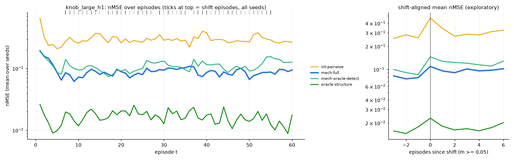

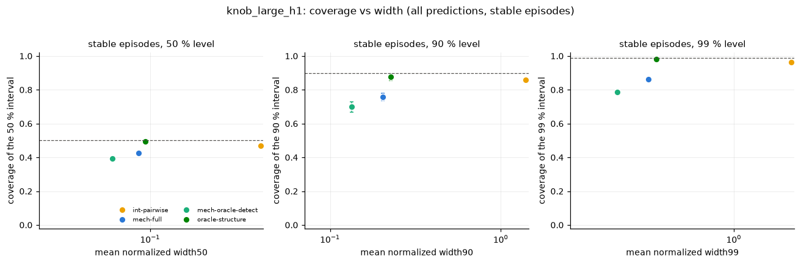

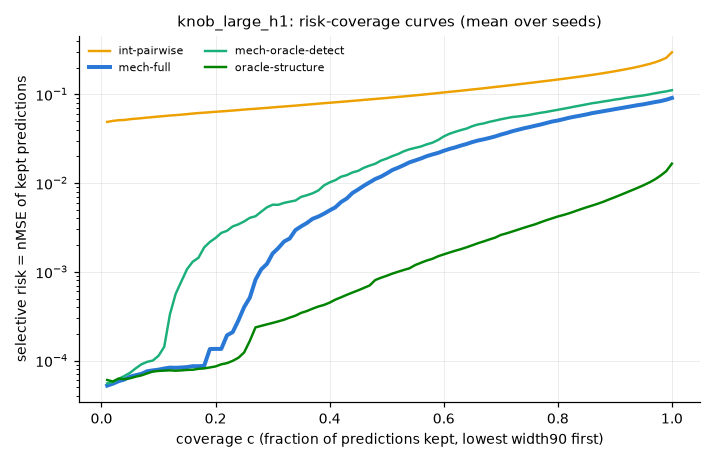

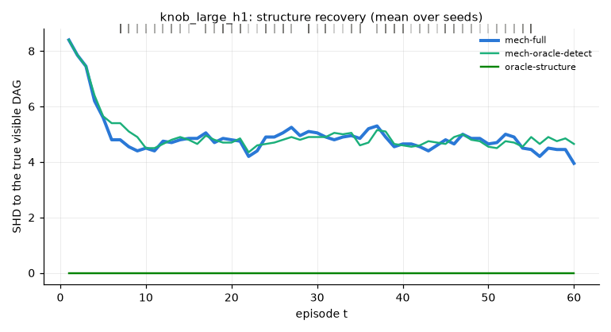

### `knob_noise-only_h0` — nMSE (Metric 1) and selective risk (Metric 5)

| agent | nMSE | stable | shift | post-shift | descendant | non-descendant | non-abstained | abstain rate | AURC | mistake recall | mistake precision | SHD 10-60 | wall s |
|---|---|---|---|---|---|---|---|---|---|---|---|---|---|
| `int-pairwise` | 0.057 [0.054, 0.059] | 0.057 [0.054, 0.059] | 0.057 [0.054, 0.059] | 0.058 [0.054, 0.061] | 0.041 [0.035, 0.046] | 0.065 [0.064, 0.067] | 0.055 [0.053, 0.058] | 0.098 [0.064, 0.136] | 0.040 [0.036, 0.043] | 0.141 [0.102, 0.185] | 0.079 [0.062, 0.098] | — | 2.188 [2.159, 2.214] |
| `mech-full` | 0.009 [0.006, 0.012] | 0.010 [0.007, 0.013] | 0.007 [0.004, 0.010] | 0.006 [0.004, 0.009] | 0.023 [0.016, 0.031] | 0.001 [0.001, 0.001] | 0.006 [0.004, 0.009] | 0.066 [0.047, 0.089] | 0.003 [0.002, 0.005] | 0.512 [0.395, 0.634] | 0.063 [0.046, 0.081] | 1.163 [0.642, 1.706] | 2.402 [2.385, 2.417] |
| `mech-oracle-detect` | 0.009 [0.006, 0.012] | 0.010 [0.007, 0.013] | 0.007 [0.004, 0.011] | 0.006 [0.004, 0.009] | 0.023 [0.016, 0.030] | 0.001 [0.001, 0.002] | 0.006 [0.004, 0.008] | 0.097 [0.072, 0.126] | 0.003 [0.002, 0.005] | 0.566 [0.444, 0.690] | 0.046 [0.034, 0.058] | 1.133 [0.619, 1.684] | 2.339 [2.326, 2.355] |
| `oracle-structure` | 0.001 [0.000, 0.001] | 0.001 [0.000, 0.001] | 0.001 [0.000, 0.001] | 0.001 [0.000, 0.001] | 0.001 [0.000, 0.001] | 0.001 [0.000, 0.001] | 0.000 [0.000, 0.001] | 0.096 [0.074, 0.121] | 0.000 [0.000, 0.000] | 1.000 [1.000, 1.000] | 0.000 [0.000, 0.000] | 0.000 [0.000, 0.000] | 2.288 [2.269, 2.309] |

Qualifying shifts pooled over seeds: 138; excluded by the m >= 0.05 filter: 22.

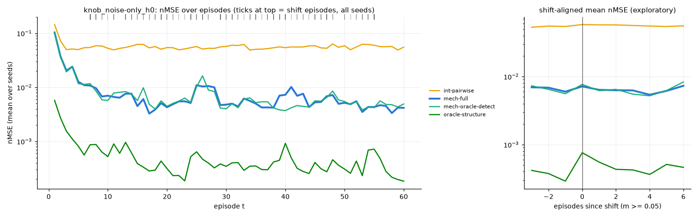

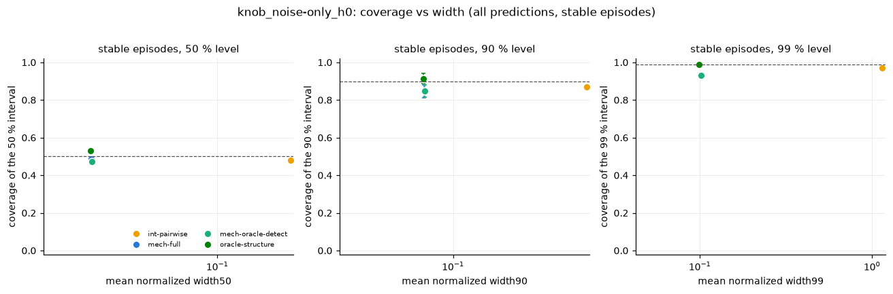

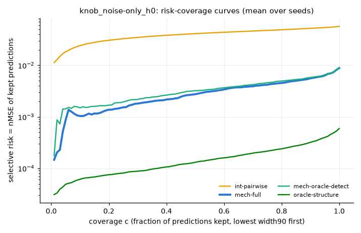

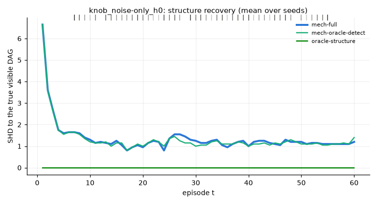

### `knob_noise-only_h1` — nMSE (Metric 1) and selective risk (Metric 5)

| agent | nMSE | stable | shift | post-shift | descendant | non-descendant | non-abstained | abstain rate | AURC | mistake recall | mistake precision | SHD 10-60 | wall s |
|---|---|---|---|---|---|---|---|---|---|---|---|---|---|
| `int-pairwise` | 0.244 [0.210, 0.280] | 0.246 [0.212, 0.283] | 0.230 [0.201, 0.259] | 0.246 [0.210, 0.291] | 0.383 [0.329, 0.443] | 0.167 [0.143, 0.192] | 0.102 [0.095, 0.109] | 0.409 [0.353, 0.461] | 0.099 [0.090, 0.108] | 0.689 [0.637, 0.734] | 0.377 [0.354, 0.400] | — | 2.143 [2.097, 2.188] |
| `mech-full` | 0.061 [0.051, 0.072] | 0.064 [0.053, 0.075] | 0.056 [0.046, 0.067] | 0.054 [0.043, 0.067] | 0.169 [0.147, 0.192] | 0.004 [0.003, 0.005] | 0.012 [0.009, 0.016] | 0.430 [0.372, 0.483] | 0.018 [0.014, 0.022] | 0.871 [0.821, 0.917] | 0.129 [0.108, 0.151] | 4.241 [3.457, 5.095] | 2.403 [2.382, 2.427] |
| `mech-oracle-detect` | 0.054 [0.044, 0.064] | 0.056 [0.046, 0.066] | 0.051 [0.041, 0.062] | 0.046 [0.036, 0.058] | 0.152 [0.131, 0.174] | 0.002 [0.001, 0.002] | 0.014 [0.010, 0.019] | 0.364 [0.312, 0.414] | 0.017 [0.014, 0.020] | 0.801 [0.735, 0.863] | 0.126 [0.107, 0.147] | 4.146 [3.351, 5.042] | 2.363 [2.335, 2.391] |
| `oracle-structure` | 0.013 [0.010, 0.016] | 0.013 [0.010, 0.016] | 0.013 [0.011, 0.017] | 0.013 [0.009, 0.017] | 0.029 [0.023, 0.035] | 0.004 [0.003, 0.005] | 0.001 [0.001, 0.001] | 0.479 [0.423, 0.529] | 0.002 [0.002, 0.003] | 1.000 [1.000, 1.000] | 0.015 [0.010, 0.020] | 0.000 [0.000, 0.000] | 2.344 [2.310, 2.379] |

Qualifying shifts pooled over seeds: 138; excluded by the m >= 0.05 filter: 22.

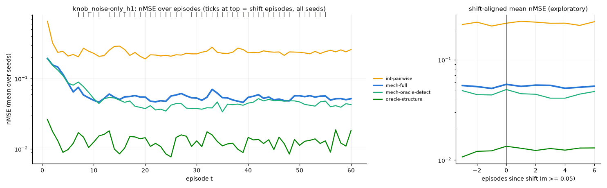

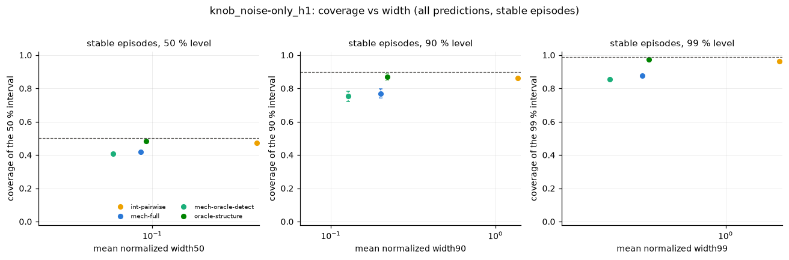

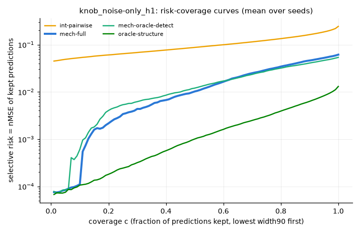

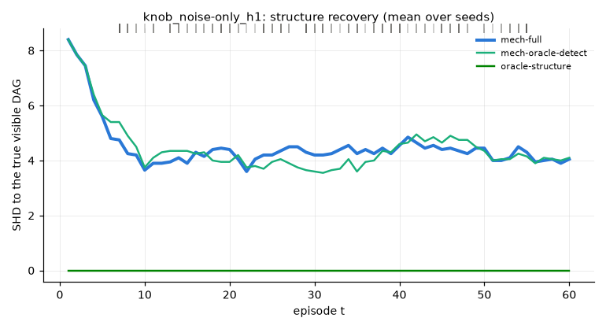

### `knob_small_h0` — nMSE (Metric 1) and selective risk (Metric 5)

| agent | nMSE | stable | shift | post-shift | descendant | non-descendant | non-abstained | abstain rate | AURC | mistake recall | mistake precision | SHD 10-60 | wall s |
|---|---|---|---|---|---|---|---|---|---|---|---|---|---|
| `int-pairwise` | 0.057 [0.055, 0.059] | 0.057 [0.054, 0.059] | 0.057 [0.054, 0.060] | 0.058 [0.055, 0.061] | 0.041 [0.036, 0.047] | 0.065 [0.064, 0.067] | 0.055 [0.053, 0.057] | 0.106 [0.071, 0.143] | 0.040 [0.037, 0.043] | 0.158 [0.113, 0.207] | 0.078 [0.064, 0.092] | — | 2.209 [2.184, 2.235] |
| `mech-full` | 0.009 [0.006, 0.013] | 0.010 [0.007, 0.014] | 0.007 [0.004, 0.011] | 0.006 [0.003, 0.010] | 0.024 [0.016, 0.033] | 0.001 [0.001, 0.001] | 0.006 [0.004, 0.009] | 0.063 [0.045, 0.082] | 0.002 [0.001, 0.004] | 0.524 [0.402, 0.645] | 0.066 [0.048, 0.086] | 1.101 [0.613, 1.671] | 2.400 [2.380, 2.420] |
| `mech-oracle-detect` | 0.009 [0.006, 0.012] | 0.010 [0.007, 0.013] | 0.007 [0.004, 0.011] | 0.006 [0.003, 0.009] | 0.023 [0.016, 0.031] | 0.001 [0.001, 0.001] | 0.006 [0.003, 0.008] | 0.102 [0.075, 0.132] | 0.003 [0.002, 0.005] | 0.557 [0.447, 0.668] | 0.045 [0.034, 0.057] | 1.055 [0.555, 1.657] | 2.336 [2.320, 2.354] |
| `oracle-structure` | 0.001 [0.001, 0.001] | 0.001 [0.001, 0.001] | 0.001 [0.001, 0.001] | 0.001 [0.001, 0.001] | 0.001 [0.001, 0.001] | 0.001 [0.000, 0.001] | 0.001 [0.000, 0.001] | 0.092 [0.070, 0.115] | 0.000 [0.000, 0.000] | 0.000 [0.000, 0.000] | 0.000 [0.000, 0.000] | 0.000 [0.000, 0.000] | 2.318 [2.295, 2.343] |

Qualifying shifts pooled over seeds: 1; excluded by the m >= 0.05 filter: 159.

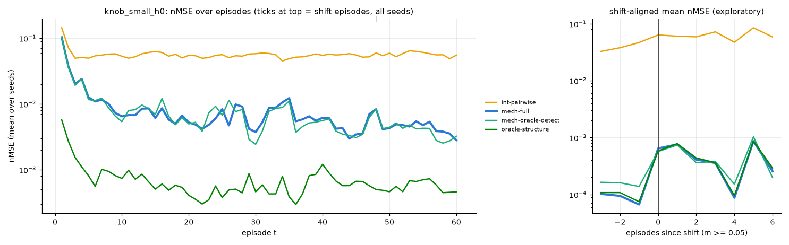

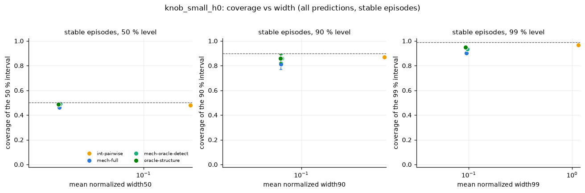

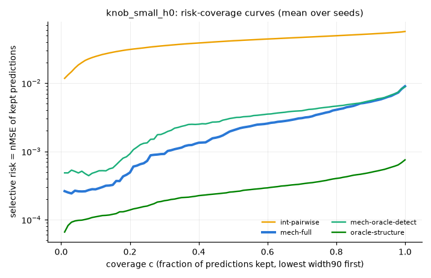

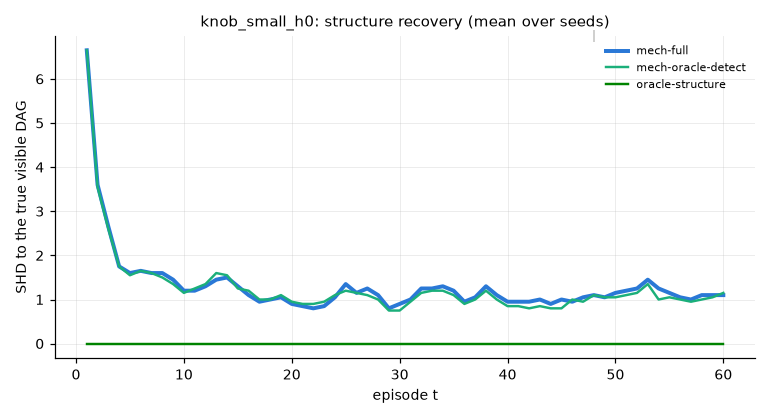

### `knob_small_h1` — nMSE (Metric 1) and selective risk (Metric 5)

| agent | nMSE | stable | shift | post-shift | descendant | non-descendant | non-abstained | abstain rate | AURC | mistake recall | mistake precision | SHD 10-60 | wall s |
|---|---|---|---|---|---|---|---|---|---|---|---|---|---|
| `int-pairwise` | 0.264 [0.222, 0.312] | 0.267 [0.224, 0.315] | 0.248 [0.210, 0.289] | 0.266 [0.225, 0.314] | 0.425 [0.355, 0.503] | 0.174 [0.147, 0.201] | 0.100 [0.093, 0.108] | 0.413 [0.364, 0.460] | 0.102 [0.093, 0.113] | 0.704 [0.656, 0.747] | 0.388 [0.368, 0.410] | — | 2.215 [2.192, 2.241] |
| `mech-full` | 0.066 [0.053, 0.082] | 0.069 [0.055, 0.084] | 0.062 [0.048, 0.080] | 0.058 [0.045, 0.074] | 0.181 [0.152, 0.215] | 0.004 [0.003, 0.006] | 0.012 [0.008, 0.016] | 0.426 [0.374, 0.475] | 0.019 [0.014, 0.024] | 0.881 [0.836, 0.921] | 0.133 [0.112, 0.155] | 4.120 [3.372, 4.942] | 2.384 [2.362, 2.409] |
| `mech-oracle-detect` | 0.058 [0.047, 0.072] | 0.060 [0.048, 0.073] | 0.057 [0.046, 0.072] | 0.049 [0.038, 0.062] | 0.163 [0.138, 0.192] | 0.002 [0.001, 0.002] | 0.016 [0.010, 0.023] | 0.389 [0.333, 0.443] | 0.019 [0.015, 0.025] | 0.810 [0.727, 0.885] | 0.121 [0.101, 0.141] | 3.978 [3.203, 4.846] | 2.326 [2.305, 2.350] |
| `oracle-structure` | 0.016 [0.011, 0.021] | 0.015 [0.011, 0.020] | 0.018 [0.013, 0.025] | 0.015 [0.010, 0.022] | 0.035 [0.027, 0.045] | 0.004 [0.003, 0.006] | 0.001 [0.001, 0.001] | 0.477 [0.427, 0.524] | 0.002 [0.002, 0.003] | 1.000 [1.000, 1.000] | 0.020 [0.013, 0.026] | 0.000 [0.000, 0.000] | 2.309 [2.290, 2.329] |

Qualifying shifts pooled over seeds: 1; excluded by the m >= 0.05 filter: 159.

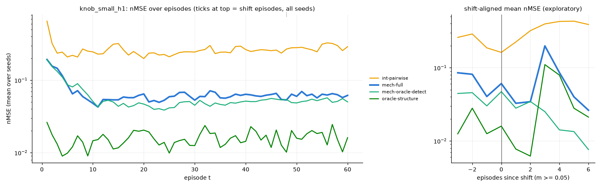

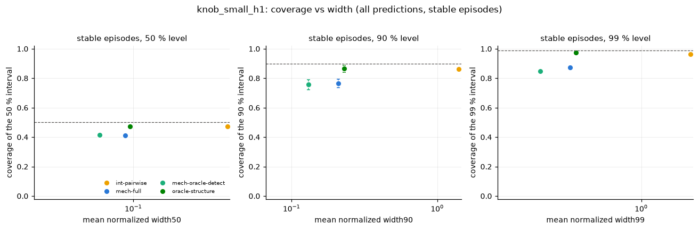

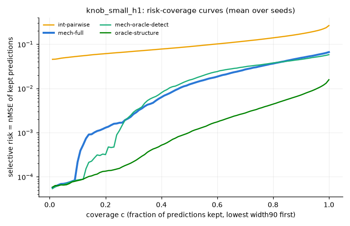

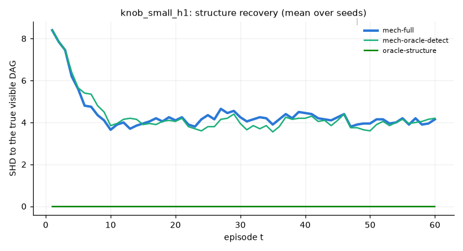

## Calibration (constants.json, validation seeds; exploratory)

lambda* = 4.759; no-shift pooled exceedance rate 0.0099, offline Page–Hinkley re-simulation 0.0073, empirical false-reset rate with shifts at lambda* 0.0202 (per mechanism-episode).

| multiplier | lambda | recall in {t, t+1} | accuracy (delay 0) | false-reset rate | misattribution rate |
|---|---|---|---|---|---|
| 0.5 | 2.38 | 1.00 | 1.00 | 0.0388 | 0.59 |
| 1 | 4.76 | 1.00 | 1.00 | 0.0202 | 0.50 |
| 2 | 9.52 | 1.00 | 1.00 | 0.0116 | 0.47 |
| 4 | 19.04 | 1.00 | 0.99 | 0.0085 | 0.47 |
| 8 | 38.07 | 1.00 | 0.95 | 0.0081 | 0.41 |

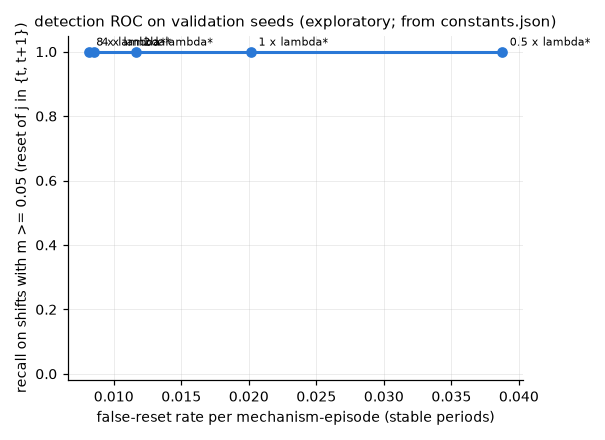

| agent | W | gamma | tau |
|---|---|---|---|
| `marginal-mean` | — | — | — |
| `obs-window` | 1 | — | 0.834 |
| `obs-cumulative` | — | — | 0.253 |
| `int-pairwise` | 3 | — | 2.465 |
| `mech-full` | — | — | 0.308 |
| `mech-random` | — | — | 0.322 |
| `mech-full-nofloor` | — | — | 0.338 |
| `mech-reset-all` | — | — | 0.416 |
| `mech-no-detect` | — | 0.50 | 0.534 |
| `mech-oracle-detect` | — | — | 0.266 |
| `mech-overconfident` | — | — | 0.329 |
| `oracle-structure` | — | — | 0.257 |
| `oracle` | — | — | — |
| `mech-full-diag` | — | — | 0.308 |

## Reading notes

- Per-seed scalars first, CIs over seeds (percentile bootstrap); event-pooled statistics use a seed-level cluster bootstrap.
- Shift-conditional numbers use shifts with `m >= 0.05` (`delta_sigma` for noise-only); the excluded count is stated per run.
- Coverage is always on all predictions, never the non-abstained subset. Abstention is the agent's own raw width90 against its tuned tau.
- P6(ii) reads 'at v = 2' as the slope error per unit v over queries with |v| >= 1 (queries draw v ~ U(-2, 2)).
- 'Detected at step 4' means a `reset_events` row (t, j) for the shifted mechanism j in the shift episode t.
